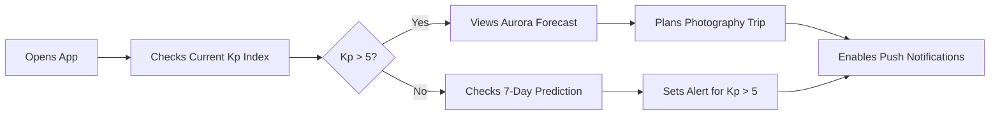
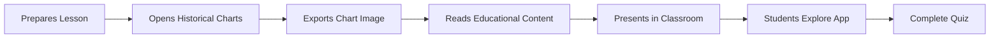
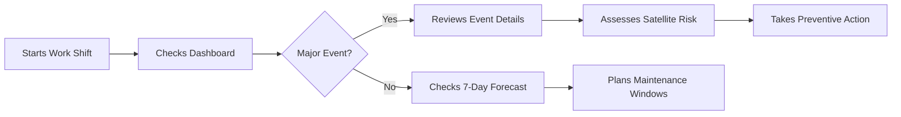
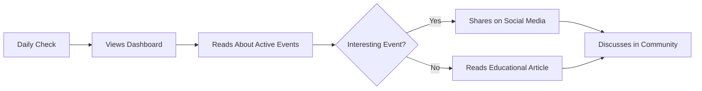
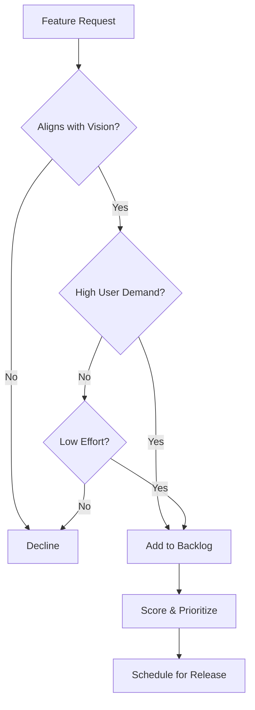

# Solar Cycle Mobile App - Feature Prioritization Matrix

**Version:** 1.0
**Date:** 2025-11-12
**Purpose:** Prioritize features for MVP and post-MVP releases

---

## Table of Contents

1. [Prioritization Framework](#prioritization-framework)
2. [MVP Features (Must-Have)](#mvp-features-must-have)
3. [Post-MVP Features (Should-Have)](#post-mvp-features-should-have)
4. [Future Enhancements (Nice-to-Have)](#future-enhancements-nice-to-have)
5. [Feature Scoring Matrix](#feature-scoring-matrix)
6. [User Stories](#user-stories)
7. [Release Roadmap](#release-roadmap)

---

## Prioritization Framework

### Scoring Criteria (1-5 scale)

| Criterion | Weight | Description |
|-----------|--------|-------------|
| **User Value** | 30% | Impact on user experience and problem-solving |
| **Business Value** | 20% | Alignment with business goals and differentiation |
| **Technical Feasibility** | 20% | Implementation complexity and risk |
| **Development Effort** | 15% | Time and resources required (inverse scoring) |
| **Dependencies** | 15% | Prerequisite features and external dependencies |

**Priority Calculation:**
```
Priority Score = (User Value × 0.30) + (Business Value × 0.20) +
                 (Technical Feasibility × 0.20) + (Effort Score × 0.15) +
                 (Dependency Score × 0.15)
```

### Priority Levels

- **P0 (Critical):** Must be in MVP - core functionality
- **P1 (High):** Should be in MVP - important features
- **P2 (Medium):** Post-MVP - valuable enhancements
- **P3 (Low):** Future releases - nice-to-have features

---

## MVP Features (Must-Have)

### P0 - Critical Features

#### 1. Real-Time Solar Data Display

**Description:** Display current solar activity metrics from NOAA, NASA, and SIDC.

**User Story:**
> As a space enthusiast, I want to see current solar activity data so that I can monitor the sun's behavior in real-time.

**Acceptance Criteria:**
- [ ] Display current sunspot number
- [ ] Display solar flux (F10.7)
- [ ] Display Kp and Ap indices
- [ ] Display geomagnetic storm level (G0-G5)
- [ ] Show data source and last update time
- [ ] Auto-refresh every 15 minutes
- [ ] Visual indicators for activity levels (low/moderate/high)

**Priority Score:** 4.8/5
- User Value: 5/5 (Core functionality)
- Business Value: 5/5 (Primary feature)
- Technical Feasibility: 5/5 (APIs available)
- Development Effort: 4/5 (Moderate effort)
- Dependencies: 5/5 (No blockers)

**Estimated Effort:** 2 weeks

---

#### 2. Solar Event Alerts

**Description:** Display active solar events (flares, CMEs, geomagnetic storms).

**User Story:**
> As an amateur astronomer, I want to be notified of significant solar events so that I can observe aurora or protect my equipment.

**Acceptance Criteria:**
- [ ] List of active solar events
- [ ] Event details (type, severity, time, location)
- [ ] Color-coded severity indicators
- [ ] Event timeline view
- [ ] Filter events by type and severity
- [ ] Event detail screen with technical data

**Priority Score:** 4.7/5
- User Value: 5/5 (High user demand)
- Business Value: 5/5 (Key differentiator)
- Technical Feasibility: 5/5 (API available)
- Development Effort: 4/5 (Moderate UI work)
- Dependencies: 4/5 (Requires data layer)

**Estimated Effort:** 2 weeks

---

#### 3. Local Data Caching

**Description:** Store solar data locally for offline access.

**User Story:**
> As a user in an area with poor connectivity, I want to access solar data offline so that I can check activity even without internet.

**Acceptance Criteria:**
- [ ] SQLite database for time-series data
- [ ] Hive storage for preferences
- [ ] Automatic cache invalidation after 24 hours
- [ ] Cache size management (max 50MB)
- [ ] Clear cache option in settings
- [ ] Stale data indicator

**Priority Score:** 4.6/5
- User Value: 4/5 (Important for UX)
- Business Value: 4/5 (Competitive advantage)
- Technical Feasibility: 5/5 (Standard practice)
- Development Effort: 5/5 (Relatively easy)
- Dependencies: 5/5 (No blockers)

**Estimated Effort:** 1 week

---

#### 4. Push Notifications for Major Events

**Description:** Send push notifications for G3+ geomagnetic storms and X-class flares.

**User Story:**
> As an aurora photographer, I want to receive alerts for major geomagnetic storms so that I can plan my photography sessions.

**Acceptance Criteria:**
- [ ] FCM integration for push notifications
- [ ] Local notifications for offline mode
- [ ] Customizable alert thresholds in settings
- [ ] Notification history
- [ ] Rich notifications with event details
- [ ] Silent hours configuration

**Priority Score:** 4.5/5
- User Value: 5/5 (High user value)
- Business Value: 5/5 (Retention driver)
- Technical Feasibility: 4/5 (FCM setup needed)
- Development Effort: 4/5 (Moderate complexity)
- Dependencies: 4/5 (Requires backend service)

**Estimated Effort:** 1.5 weeks

---

#### 5. Historical Data Visualization

**Description:** Charts showing solar activity trends over time.

**User Story:**
> As an educator, I want to view historical solar activity trends so that I can teach students about solar cycles.

**Acceptance Criteria:**
- [ ] Line chart for sunspot numbers
- [ ] Line chart for solar flux
- [ ] Time range selector (7d, 30d, 1y, all)
- [ ] Zoom and pan functionality
- [ ] Data point tooltips
- [ ] Export chart as image

**Priority Score:** 4.3/5
- User Value: 4/5 (Educational value)
- Business Value: 4/5 (Content richness)
- Technical Feasibility: 5/5 (fl_chart library)
- Development Effort: 4/5 (Chart customization)
- Dependencies: 4/5 (Requires historical data)

**Estimated Effort:** 2 weeks

---

#### 6. Basic Settings

**Description:** User preferences for notifications, themes, and data refresh.

**User Story:**
> As a user, I want to customize app behavior so that it fits my preferences and device capabilities.

**Acceptance Criteria:**
- [ ] Notification preferences
- [ ] Theme selection (light/dark/system)
- [ ] Data refresh interval
- [ ] Alert severity threshold
- [ ] Cache management
- [ ] About/help section

**Priority Score:** 4.2/5
- User Value: 4/5 (Personalization)
- Business Value: 3/5 (Standard feature)
- Technical Feasibility: 5/5 (Straightforward)
- Development Effort: 5/5 (Simple implementation)
- Dependencies: 5/5 (No blockers)

**Estimated Effort:** 1 week

---

### P1 - High Priority (MVP if time permits)

#### 7. AI/ML Solar Activity Predictions

**Description:** 7-day forecast of solar activity using on-device ML model.

**User Story:**
> As a satellite operator, I want to see predicted solar activity so that I can plan operations and minimize risk.

**Acceptance Criteria:**
- [ ] 7-day sunspot number prediction
- [ ] 7-day solar flux prediction
- [ ] Confidence intervals displayed
- [ ] Prediction accuracy metrics
- [ ] Model version and update status
- [ ] Fallback to statistical forecast if ML unavailable

**Priority Score:** 4.1/5
- User Value: 5/5 (Unique feature)
- Business Value: 5/5 (Major differentiator)
- Technical Feasibility: 3/5 (ML complexity)
- Development Effort: 2/5 (High effort)
- Dependencies: 3/5 (Requires model training)

**Estimated Effort:** 3 weeks

**Risk:** High complexity - may be deferred to post-MVP

---

#### 8. Offline Mode Indicator

**Description:** Clear UI indication of online/offline status and data freshness.

**User Story:**
> As a user, I want to know if I'm viewing live or cached data so that I can trust the information.

**Acceptance Criteria:**
- [ ] Connection status indicator
- [ ] Last update timestamp
- [ ] Stale data warning
- [ ] Manual refresh button
- [ ] Sync progress indicator
- [ ] Error state handling

**Priority Score:** 4.0/5
- User Value: 4/5 (Trust building)
- Business Value: 3/5 (Quality indicator)
- Technical Feasibility: 5/5 (Simple implementation)
- Development Effort: 5/5 (Minimal effort)
- Dependencies: 4/5 (Requires connectivity service)

**Estimated Effort:** 3 days

---

## Post-MVP Features (Should-Have)

### P2 - Medium Priority

#### 9. Educational Content

**Description:** In-app articles and videos explaining solar phenomena.

**User Story:**
> As a student, I want to learn about solar activity so that I can understand what the data means.

**Acceptance Criteria:**
- [ ] Article library on solar topics
- [ ] Glossary of terms
- [ ] Video tutorials (YouTube embeds)
- [ ] Interactive diagrams
- [ ] Quiz/assessment feature
- [ ] Bookmark favorite articles

**Priority Score:** 3.8/5
- User Value: 4/5 (Educational value)
- Business Value: 4/5 (Content differentiation)
- Technical Feasibility: 4/5 (Content creation effort)
- Development Effort: 3/5 (Content + UI)
- Dependencies: 4/5 (Content sourcing)

**Estimated Effort:** 2 weeks

**Target Release:** v1.1 (1-2 months post-MVP)

---

#### 10. Aurora Forecast

**Description:** Predict aurora visibility based on geomagnetic activity and user location.

**User Story:**
> As an aurora photographer, I want to know if aurora will be visible in my area so that I can plan photography trips.

**Acceptance Criteria:**
- [ ] Aurora probability by latitude
- [ ] Location-based visibility forecast
- [ ] Aurora oval visualization
- [ ] Best viewing times
- [ ] Cloud cover integration
- [ ] Camera settings recommendations

**Priority Score:** 3.7/5
- User Value: 5/5 (High value for subset)
- Business Value: 4/5 (Niche but valuable)
- Technical Feasibility: 3/5 (Complex calculations)
- Development Effort: 3/5 (Moderate effort)
- Dependencies: 3/5 (Requires location, weather API)

**Estimated Effort:** 2.5 weeks

**Target Release:** v1.2 (2-3 months post-MVP)

---

#### 11. Social Sharing

**Description:** Share solar events and charts on social media.

**User Story:**
> As an enthusiast, I want to share interesting solar events with my community so that I can discuss and educate others.

**Acceptance Criteria:**
- [ ] Share event details (text + image)
- [ ] Share charts as images
- [ ] Pre-formatted social media posts
- [ ] Share to Twitter, Facebook, Reddit
- [ ] Custom watermark on images
- [ ] Privacy-preserving sharing

**Priority Score:** 3.5/5
- User Value: 3/5 (Nice to have)
- Business Value: 4/5 (Viral potential)
- Technical Feasibility: 5/5 (Standard APIs)
- Development Effort: 4/5 (Low effort)
- Dependencies: 4/5 (No major blockers)

**Estimated Effort:** 1 week

**Target Release:** v1.1 (1-2 months post-MVP)

---

#### 12. Widget Support

**Description:** Home screen widgets showing current solar activity.

**User Story:**
> As a user, I want a home screen widget so that I can glance at solar activity without opening the app.

**Acceptance Criteria:**
- [ ] Small widget (current Kp index)
- [ ] Medium widget (multiple metrics)
- [ ] Large widget (chart + metrics)
- [ ] Auto-update (iOS: timeline, Android: periodic)
- [ ] Tap to open app
- [ ] Configurable widget content

**Priority Score:** 3.4/5
- User Value: 4/5 (Convenience)
- Business Value: 3/5 (Engagement boost)
- Technical Feasibility: 3/5 (Platform-specific)
- Development Effort: 3/5 (Platform differences)
- Dependencies: 4/5 (Requires background work)

**Estimated Effort:** 2 weeks

**Target Release:** v1.2 (2-3 months post-MVP)

---

#### 13. User Accounts & Sync

**Description:** Optional user accounts for syncing preferences across devices.

**User Story:**
> As a user with multiple devices, I want my settings synchronized so that I have a consistent experience.

**Acceptance Criteria:**
- [ ] Anonymous authentication (default)
- [ ] Email/password sign-up
- [ ] Social login (Google, Apple)
- [ ] Cloud sync for preferences
- [ ] Cross-device notification management
- [ ] Account deletion

**Priority Score:** 3.3/5
- User Value: 3/5 (For multi-device users)
- Business Value: 4/5 (User retention)
- Technical Feasibility: 4/5 (Firebase Auth)
- Development Effort: 3/5 (Auth flows)
- Dependencies: 3/5 (Backend setup)

**Estimated Effort:** 2 weeks

**Target Release:** v1.3 (3-4 months post-MVP)

---

## Future Enhancements (Nice-to-Have)

### P3 - Low Priority

#### 14. Satellite Impact Predictions

**Description:** Predict impact on specific satellite systems.

**User Story:**
> As a satellite operator, I want to know potential impacts on my satellites so that I can take preventive measures.

**Acceptance Criteria:**
- [ ] Satellite database
- [ ] Orbit visualization
- [ ] Impact probability calculation
- [ ] Recommendation engine
- [ ] Custom satellite tracking
- [ ] Historical impact correlation

**Priority Score:** 3.0/5
- User Value: 5/5 (For specific audience)
- Business Value: 3/5 (Niche market)
- Technical Feasibility: 2/5 (Complex domain)
- Development Effort: 1/5 (Very high effort)
- Dependencies: 2/5 (External data needed)

**Estimated Effort:** 4+ weeks

**Target Release:** v2.0+ (6+ months post-MVP)

---

#### 15. AR Visualization

**Description:** Augmented reality view of sun with active regions.

**User Story:**
> As an educator, I want to show students an AR sun so that they can visualize solar phenomena in 3D.

**Acceptance Criteria:**
- [ ] AR view of sun
- [ ] Active regions highlighted
- [ ] CME animations
- [ ] Solar flare indicators
- [ ] Educational labels
- [ ] Screenshot/video capture

**Priority Score:** 2.8/5
- User Value: 4/5 (Wow factor)
- Business Value: 4/5 (Marketing value)
- Technical Feasibility: 2/5 (AR complexity)
- Development Effort: 1/5 (Very high effort)
- Dependencies: 2/5 (AR framework, 3D models)

**Estimated Effort:** 5+ weeks

**Target Release:** v2.0+ (6+ months post-MVP)

---

#### 16. Community Forum

**Description:** In-app community for discussion and photo sharing.

**User Story:**
> As an enthusiast, I want to connect with others so that I can share observations and learn from the community.

**Acceptance Criteria:**
- [ ] Discussion threads
- [ ] Photo gallery
- [ ] User profiles
- [ ] Moderation tools
- [ ] Notification system
- [ ] Search functionality

**Priority Score:** 2.7/5
- User Value: 3/5 (For engaged users)
- Business Value: 3/5 (Community building)
- Technical Feasibility: 3/5 (Moderation challenges)
- Development Effort: 1/5 (High effort)
- Dependencies: 2/5 (Backend infrastructure)

**Estimated Effort:** 6+ weeks

**Target Release:** v2.0+ (6+ months post-MVP)

---

#### 17. IoT Integration

**Description:** Connect with IoT devices (weather stations, cameras).

**User Story:**
> As a researcher, I want to integrate my equipment so that I can correlate solar data with local measurements.

**Acceptance Criteria:**
- [ ] Device pairing (Bluetooth, WiFi)
- [ ] Data ingestion from devices
- [ ] Automated photography triggers
- [ ] Data export to devices
- [ ] Device management
- [ ] Custom automation rules

**Priority Score:** 2.5/5
- User Value: 4/5 (For hobbyists)
- Business Value: 2/5 (Niche audience)
- Technical Feasibility: 2/5 (Hardware complexity)
- Development Effort: 1/5 (Very high effort)
- Dependencies: 1/5 (Hardware partnerships)

**Estimated Effort:** 8+ weeks

**Target Release:** TBD (potentially separate product)

---

## Feature Scoring Matrix

### Complete Priority Ranking

| Rank | Feature | Priority | Score | Effort | Release |
|------|---------|----------|-------|--------|---------|
| 1 | Real-Time Solar Data Display | P0 | 4.8 | 2w | MVP |
| 2 | Solar Event Alerts | P0 | 4.7 | 2w | MVP |
| 3 | Local Data Caching | P0 | 4.6 | 1w | MVP |
| 4 | Push Notifications | P0 | 4.5 | 1.5w | MVP |
| 5 | Historical Data Visualization | P0 | 4.3 | 2w | MVP |
| 6 | Basic Settings | P0 | 4.2 | 1w | MVP |
| 7 | AI/ML Predictions | P1 | 4.1 | 3w | MVP* |
| 8 | Offline Mode Indicator | P1 | 4.0 | 3d | MVP |
| 9 | Educational Content | P2 | 3.8 | 2w | v1.1 |
| 10 | Aurora Forecast | P2 | 3.7 | 2.5w | v1.2 |
| 11 | Social Sharing | P2 | 3.5 | 1w | v1.1 |
| 12 | Widget Support | P2 | 3.4 | 2w | v1.2 |
| 13 | User Accounts & Sync | P2 | 3.3 | 2w | v1.3 |
| 14 | Satellite Impact Predictions | P3 | 3.0 | 4w+ | v2.0+ |
| 15 | AR Visualization | P3 | 2.8 | 5w+ | v2.0+ |
| 16 | Community Forum | P3 | 2.7 | 6w+ | v2.0+ |
| 17 | IoT Integration | P3 | 2.5 | 8w+ | TBD |

*MVP if time permits, otherwise v1.1

---

## User Stories

### Persona 1: Aurora Photographer (Sarah)

**Background:** Amateur photographer in Alaska, frequently travels for aurora photography.

**Goals:**
- Receive timely alerts for aurora-favorable conditions
- Access historical data to plan trips
- View aurora forecast for specific locations

**Key Features:**
- Push notifications (P0)
- Aurora forecast (P2)
- Historical data charts (P0)

**User Journey:**


---

### Persona 2: Educator (Dr. Martinez)

**Background:** High school physics teacher, uses tech in classroom.

**Goals:**
- Teach students about solar cycles
- Visualize complex solar phenomena
- Engage students with real-time data

**Key Features:**
- Historical charts (P0)
- Educational content (P2)
- Social sharing (P2)
- AR visualization (P3 - future)

**User Journey:**


---

### Persona 3: Satellite Operator (John)

**Background:** Works for commercial satellite company, monitors space weather.

**Goals:**
- Monitor real-time solar activity
- Predict potential satellite impacts
- Receive critical event alerts

**Key Features:**
- Real-time data (P0)
- Push notifications (P0)
- AI predictions (P1)
- Satellite impact predictions (P3 - future)

**User Journey:**


---

### Persona 4: Space Enthusiast (Emily)

**Background:** Hobbyist interested in space weather, follows solar cycles.

**Goals:**
- Stay informed about solar activity
- Learn about solar phenomena
- Share interesting events with friends

**Key Features:**
- Real-time data (P0)
- Event alerts (P0)
- Educational content (P2)
- Social sharing (P2)

**User Journey:**


---

## Release Roadmap

### MVP (v1.0) - Week 16

**Theme:** Core Solar Monitoring

**Features:**
- ✅ Real-time solar data display
- ✅ Solar event alerts
- ✅ Local data caching
- ✅ Push notifications for major events
- ✅ Historical data visualization
- ✅ Basic settings
- ✅ Offline mode indicator
- ⚠️ AI/ML predictions (if time permits)

**Success Criteria:**
- 1,000+ downloads in first month
- 4+ star rating
- < 1% crash rate
- 30% DAU/MAU ratio

---

### v1.1 (Post-MVP + 1-2 months)

**Theme:** Content & Engagement

**Features:**
- ✅ Educational content library
- ✅ Social sharing
- ✅ Enhanced notifications (rich media)
- ✅ AI/ML predictions (if not in MVP)
- ✅ Performance optimizations
- ✅ Bug fixes from user feedback

**Success Criteria:**
- 3,000+ total downloads
- Average session length > 4 minutes
- 50% user retention (30-day)

---

### v1.2 (Post-MVP + 2-3 months)

**Theme:** Advanced Features

**Features:**
- ✅ Aurora forecast
- ✅ Home screen widgets
- ✅ Tablet optimization
- ✅ Landscape mode support
- ✅ Data export functionality
- ✅ Improved charts (more data, zoom)

**Success Criteria:**
- 5,000+ total downloads
- 35% DAU/MAU ratio
- Widget adoption by 20% of users

---

### v1.3 (Post-MVP + 3-4 months)

**Theme:** Personalization & Sync

**Features:**
- ✅ User accounts
- ✅ Cloud sync
- ✅ Custom alert rules
- ✅ Multiple location tracking
- ✅ Favorite events
- ✅ Notification channels

**Success Criteria:**
- 10,000+ total downloads
- 25% account creation rate
- 60% user retention (30-day)

---

### v2.0 (Post-MVP + 6+ months)

**Theme:** Advanced Capabilities

**Features (TBD based on user feedback):**
- ⚠️ Satellite impact predictions
- ⚠️ AR visualization
- ⚠️ Community forum
- ⚠️ API for third-party integrations
- ⚠️ Premium subscription tier
- ⚠️ Advanced analytics

**Success Criteria:**
- 50,000+ total downloads
- Sustainable monetization
- Active community

---

## Feature Request Process

### User Feedback Collection

1. **In-App Feedback:** Built-in feedback form
2. **App Store Reviews:** Monitor and respond
3. **Social Media:** Twitter, Reddit communities
4. **Analytics:** Track feature usage

### Evaluation Criteria

New feature requests will be evaluated using:
- User demand (number of requests)
- Alignment with product vision
- Technical feasibility
- Development cost
- Maintenance burden

### Decision Framework



---

## Conclusion

This prioritization matrix ensures that development efforts are focused on features that provide the most value to users while being feasible within the constraints of time, budget, and technical resources. The MVP focuses on core solar monitoring capabilities, with subsequent releases adding educational content, advanced predictions, and community features based on user feedback and analytics.

**Key Principles:**
1. **User-Centric:** Features are prioritized based on user value
2. **Data-Driven:** Decisions informed by analytics and feedback
3. **Iterative:** Regular releases with incremental improvements
4. **Flexible:** Roadmap adjusts based on learnings

**Next Steps:**
1. Review and validate with stakeholders
2. Create detailed user stories for P0 features
3. Break down features into development tasks
4. Assign resources and create sprint plans

---

**Document End**
