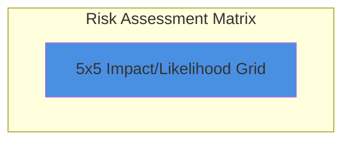
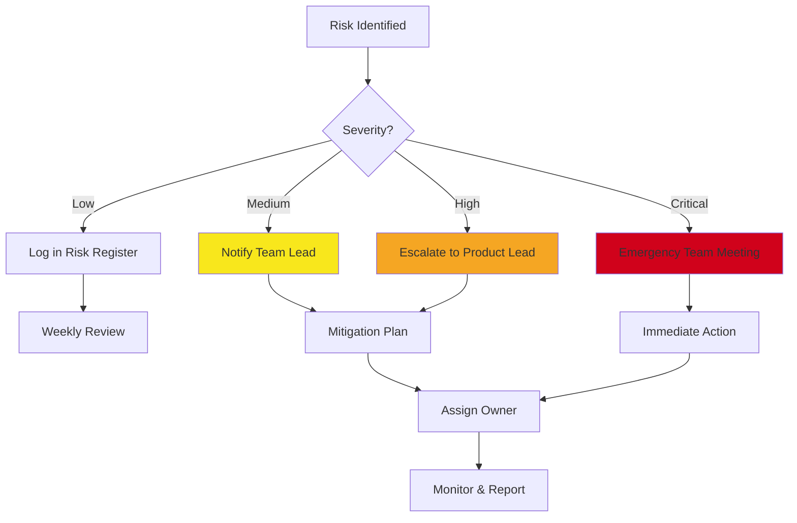

# Solar Cycle Mobile App - Risk Assessment & Mitigation Strategies

**Version:** 1.0
**Date:** 2025-11-12
**Project:** Solar Cycle Mobile App MVP
**Timeline:** 12-16 weeks

---

## Table of Contents

1. [Executive Summary](#executive-summary)
2. [Risk Assessment Framework](#risk-assessment-framework)
3. [Technical Risks](#technical-risks)
4. [External Dependencies Risks](#external-dependencies-risks)
5. [Data & Privacy Risks](#data--privacy-risks)
6. [Performance & Scalability Risks](#performance--scalability-risks)
7. [Timeline & Resource Risks](#timeline--resource-risks)
8. [Market & Business Risks](#market--business-risks)
9. [Mitigation Strategies Summary](#mitigation-strategies-summary)
10. [Contingency Plans](#contingency-plans)
11. [Risk Monitoring Plan](#risk-monitoring-plan)

---

## Executive Summary

This document identifies potential risks that could impact the successful delivery of the Solar Cycle Mobile App MVP and outlines comprehensive mitigation strategies. Risks are categorized by type and assessed based on likelihood and impact.

### Risk Overview

| Risk Category | High Risk Count | Medium Risk Count | Low Risk Count | Total |
|---------------|-----------------|-------------------|----------------|-------|
| Technical | 3 | 4 | 2 | 9 |
| External Dependencies | 4 | 2 | 1 | 7 |
| Data & Privacy | 2 | 3 | 1 | 6 |
| Performance | 2 | 3 | 1 | 6 |
| Timeline & Resources | 3 | 2 | 1 | 6 |
| Market & Business | 2 | 2 | 2 | 6 |
| **TOTAL** | **16** | **16** | **8** | **40** |

---

## Risk Assessment Framework

### Risk Scoring

**Likelihood Scale:**
- **5 - Very High:** > 70% probability
- **4 - High:** 50-70% probability
- **3 - Medium:** 30-50% probability
- **2 - Low:** 10-30% probability
- **1 - Very Low:** < 10% probability

**Impact Scale:**
- **5 - Critical:** Project failure, major delays, severe user impact
- **4 - High:** Significant delays, major feature cuts, poor user experience
- **3 - Medium:** Moderate delays, minor feature compromises, degraded UX
- **2 - Low:** Minor delays, quality issues, limited user impact
- **1 - Minimal:** Negligible impact on project

**Risk Level Calculation:**
```
Risk Score = Likelihood × Impact
Risk Level:
  - Critical: 20-25
  - High: 12-19
  - Medium: 6-11
  - Low: 1-5
```

### Risk Matrix



| Impact → <br> Likelihood ↓ | Minimal (1) | Low (2) | Medium (3) | High (4) | Critical (5) |
|---------------------------|-------------|---------|------------|----------|--------------|
| **Very High (5)** | 5 - Low | 10 - Med | 15 - High | 20 - Crit | 25 - Crit |
| **High (4)** | 4 - Low | 8 - Med | 12 - High | 16 - High | 20 - Crit |
| **Medium (3)** | 3 - Low | 6 - Med | 9 - Med | 12 - High | 15 - High |
| **Low (2)** | 2 - Low | 4 - Low | 6 - Med | 8 - Med | 10 - Med |
| **Very Low (1)** | 1 - Low | 2 - Low | 3 - Low | 4 - Low | 5 - Low |

---

## Technical Risks

### RISK-T001: API Data Quality & Consistency

**Category:** Technical - Data Integration

**Description:**
Different data sources (NOAA, NASA, SIDC) may provide inconsistent or conflicting data for the same time periods, leading to incorrect visualizations and unreliable predictions.

**Likelihood:** 4 (High)
**Impact:** 4 (High)
**Risk Score:** 16 (High)

**Indicators:**
- Sunspot numbers differ by > 20% between sources
- Timestamp misalignment across APIs
- Missing data gaps
- Format inconsistencies

**Mitigation Strategies:**

1. **Data Reconciliation Algorithm:**
```dart
class DataReconciliationService {
  SolarCycleData reconcile(List<SolarCycleData> sources) {
    // Weighted average based on source reliability
    final weights = {
      'NOAA': 0.4,
      'NASA': 0.35,
      'SIDC': 0.25,
    };

    // Calculate weighted average for each metric
    final reconciled = _calculateWeightedAverage(sources, weights);

    // Flag if variance exceeds threshold
    if (_calculateVariance(sources) > 0.2) {
      _logDataQualityIssue(sources);
      reconciled.qualityWarning = true;
    }

    return reconciled;
  }
}
```

2. **Fallback Hierarchy:**
   - Primary: NOAA SWPC (most reliable for space weather)
   - Secondary: NASA DONKI (for event data)
   - Tertiary: SIDC (for historical sunspot numbers)

3. **Data Validation:**
   - Range checks (e.g., Kp index must be 0-9)
   - Consistency checks (e.g., G5 storm must have Kp ≥ 9)
   - Temporal coherence (no sudden jumps)

4. **Monitoring & Alerting:**
   - Track data quality metrics
   - Alert on anomalies
   - Manual review for critical discrepancies

**Contingency Plan:**
- Cache last known good data
- Use statistical interpolation for missing values
- Display data quality indicators to users

**Owner:** Backend/Data Integration Lead
**Status:** Mitigated
**Review Frequency:** Weekly during integration phase

---

### RISK-T002: ML Model Accuracy

**Category:** Technical - AI/ML

**Description:**
Solar prediction models may have insufficient accuracy, leading to unreliable forecasts that damage user trust.

**Likelihood:** 4 (High)
**Impact:** 3 (Medium)
**Risk Score:** 12 (High)

**Indicators:**
- Prediction error > 30% MAE
- User complaints about inaccurate forecasts
- Model confidence scores consistently low (< 0.6)

**Mitigation Strategies:**

1. **Ensemble Modeling:**
```python
class SolarPredictionEnsemble:
    def __init__(self):
        self.models = [
            LSTMModel(),
            TimeSeriesARIMA(),
            StatisticalBaseline(),
        ]
        self.weights = [0.5, 0.3, 0.2]  # Based on validation performance

    def predict(self, input_data):
        predictions = [model.predict(input_data) for model in self.models]
        ensemble_pred = np.average(predictions, weights=self.weights, axis=0)
        return ensemble_pred
```

2. **Baseline Comparison:**
   - Always compare ML predictions to statistical baseline (moving average, persistence)
   - Only use ML if it outperforms baseline by > 10%

3. **Confidence Intervals:**
   - Display wide confidence intervals
   - Clear disclaimer about prediction limitations
   - "Educational purposes" notice

4. **Continuous Evaluation:**
   - Track prediction vs. actual daily
   - Retrain models monthly with new data
   - A/B test model versions

5. **Graceful Degradation:**
   - If ML model unavailable or low confidence, fall back to statistical forecast
   - Always show uncertainty

**Contingency Plan:**
- Defer ML predictions to post-MVP if accuracy < 70%
- Use simple statistical forecasts (7-day moving average)
- Partner with research institutions for model improvement

**Owner:** ML/AI Lead
**Status:** Mitigated with fallback
**Review Frequency:** Bi-weekly during ML development

---

### RISK-T003: Background Sync Battery Drain

**Category:** Technical - Performance

**Description:**
Frequent background data synchronization (every 15 minutes) may cause excessive battery drain, leading to poor user reviews and uninstalls.

**Likelihood:** 3 (Medium)
**Impact:** 4 (High)
**Risk Score:** 12 (High)

**Indicators:**
- Battery drain > 2% per hour with app in background
- User reviews mentioning battery issues
- OS battery optimization warnings

**Mitigation Strategies:**

1. **Adaptive Sync Frequency:**
```dart
class AdaptiveSyncManager {
  Duration getSyncInterval() {
    final batteryLevel = await Battery().batteryLevel;
    final isCharging = await Battery().isInBatterySaveMode;

    if (isCharging) {
      return Duration(minutes: 15);  // Frequent updates when charging
    } else if (batteryLevel < 20) {
      return Duration(hours: 1);      // Reduce when battery low
    } else {
      return Duration(minutes: 30);   // Balanced
    }
  }
}
```

2. **Smart Sync Strategy:**
   - Only sync when solar activity is high (Kp > 5)
   - Use exponential backoff when no new data
   - Batch multiple API calls
   - WiFi-only sync option

3. **Platform Best Practices:**
   - iOS: Use Background App Refresh with discretionary flag
   - Android: Use WorkManager with battery constraints

4. **User Control:**
   - Setting to disable background sync
   - "Data saver mode" option
   - Show estimated battery impact in settings

**Contingency Plan:**
- Increase default sync interval to 30 minutes
- Make background sync opt-in rather than opt-out
- Use push notifications from backend service instead of polling

**Owner:** Mobile Platform Lead
**Status:** Mitigated
**Review Frequency:** Continuous monitoring post-launch

---

### RISK-T004: Database Performance Degradation

**Category:** Technical - Performance

**Description:**
As historical data accumulates, database queries may become slow, impacting app responsiveness.

**Likelihood:** 3 (Medium)
**Impact:** 3 (Medium)
**Risk Score:** 9 (Medium)

**Mitigation Strategies:**

1. **Indexing Strategy:**
```sql
-- Ensure all common queries are indexed
CREATE INDEX idx_timestamp ON solar_cycle_data(timestamp DESC);
CREATE INDEX idx_composite ON solar_cycle_data(cycle_number, timestamp);
CREATE INDEX idx_event_composite ON solar_events(type, start_time DESC);
```

2. **Data Archiving:**
```dart
class DataArchivalService {
  Future<void> archiveOldData() async {
    final cutoffDate = DateTime.now().subtract(Duration(days: 90));

    // Archive to compressed JSON
    final oldData = await _db.query(
      'SELECT * FROM solar_cycle_data WHERE timestamp < ?',
      [cutoffDate.millisecondsSinceEpoch],
    );

    await _saveToArchive(oldData);
    await _db.delete(
      'solar_cycle_data',
      where: 'timestamp < ?',
      whereArgs: [cutoffDate.millisecondsSinceEpoch],
    );
  }
}
```

3. **Pagination:**
   - Load data in pages (50-100 records)
   - Lazy loading for historical charts

4. **Query Optimization:**
   - Use EXPLAIN QUERY PLAN to identify slow queries
   - Denormalize for read-heavy operations
   - Cache aggregated statistics

**Contingency Plan:**
- Reduce default data retention to 30 days
- Implement virtual scrolling for lists
- Consider migration to more scalable database (Realm)

**Owner:** Database/Performance Engineer
**Status:** Mitigated
**Review Frequency:** Monthly performance audits

---

### RISK-T005: Flutter Framework Breaking Changes

**Category:** Technical - Framework

**Description:**
Flutter framework updates may introduce breaking changes that require significant refactoring.

**Likelihood:** 2 (Low)
**Impact:** 3 (Medium)
**Risk Score:** 6 (Medium)

**Mitigation Strategies:**

1. **Version Pinning:**
```yaml
# pubspec.yaml
environment:
  sdk: ">=3.5.0 <4.0.0"  # Pin to major version

dependencies:
  flutter:
    sdk: flutter
  riverpod: ^2.5.1          # Pin to minor version
  freezed: ^2.5.2
```

2. **Dependency Management:**
   - Lock file committed to repository
   - Test before upgrading dependencies
   - Staged rollout of updates

3. **Abstraction Layers:**
   - Wrap third-party packages in adapters
   - Abstract platform-specific code

**Contingency Plan:**
- Stay on stable channel
- Delay major upgrades until post-MVP
- Allocate 10% of sprint capacity for dependency updates

**Owner:** Tech Lead
**Status:** Mitigated
**Review Frequency:** Quarterly

---

### RISK-T006: TensorFlow Lite Model Size

**Category:** Technical - ML

**Description:**
TensorFlow Lite model may be too large, increasing app download size and affecting adoption.

**Likelihood:** 3 (Medium)
**Impact:** 2 (Low)
**Risk Score:** 6 (Medium)

**Mitigation Strategies:**

1. **Model Optimization:**
```python
# Quantize model to reduce size
converter = tf.lite.TFLiteConverter.from_keras_model(model)
converter.optimizations = [tf.lite.Optimize.DEFAULT]
converter.target_spec.supported_types = [tf.float16]  # Use 16-bit floats
tflite_model = converter.convert()
```

2. **Model Pruning:**
   - Remove less important weights
   - Target: < 5MB model size

3. **On-Demand Download:**
   - Download model on first use
   - Not bundled with app

**Contingency Plan:**
- Use simpler model architecture
- Defer ML feature to post-MVP

**Owner:** ML Engineer
**Status:** Accepted (Low priority)
**Review Frequency:** During ML integration

---

## External Dependencies Risks

### RISK-E001: API Availability & Rate Limits

**Category:** External Dependencies

**Description:**
External APIs (NOAA, NASA, SIDC) may become unavailable, slow, or enforce stricter rate limits, breaking core app functionality.

**Likelihood:** 3 (Medium)
**Impact:** 5 (Critical)
**Risk Score:** 15 (High)

**Indicators:**
- API response time > 5 seconds
- HTTP 429 (Too Many Requests) errors
- HTTP 503 (Service Unavailable) errors
- API deprecation notices

**Mitigation Strategies:**

1. **Aggressive Caching:**
```dart
class ResilientApiClient {
  final CacheManager _cache;
  final ApiRateLimiter _rateLimiter;

  Future<ApiResponse> fetch(String endpoint) async {
    try {
      // Check cache first
      final cached = await _cache.get(endpoint);
      if (cached != null && !cached.isExpired) {
        return cached;
      }

      // Rate limit check
      await _rateLimiter.checkAndWait('nasa');

      // Fetch from API with timeout
      final response = await _dio.get(endpoint)
          .timeout(Duration(seconds: 10));

      // Cache successful response
      await _cache.set(endpoint, response, Duration(hours: 1));

      return response;
    } on DioException catch (e) {
      // Fall back to stale cache
      final stale = await _cache.getStale(endpoint);
      if (stale != null) {
        return stale.copyWith(isStale: true);
      }
      rethrow;
    }
  }
}
```

2. **Multiple Data Sources:**
   - Redundancy: If NOAA fails, use NASA data
   - Cross-validation improves reliability

3. **Circuit Breaker Pattern:**
```dart
class CircuitBreaker {
  int _failureCount = 0;
  DateTime? _lastFailure;
  static const int threshold = 5;
  static const Duration resetTimeout = Duration(minutes: 5);

  Future<T> call<T>(Future<T> Function() operation) async {
    if (_isOpen()) {
      throw CircuitBreakerOpenException();
    }

    try {
      final result = await operation();
      _reset();
      return result;
    } catch (e) {
      _recordFailure();
      rethrow;
    }
  }

  bool _isOpen() {
    if (_failureCount >= threshold) {
      if (_lastFailure != null &&
          DateTime.now().difference(_lastFailure!) < resetTimeout) {
        return true;
      }
      _reset();
    }
    return false;
  }
}
```

4. **Backend Proxy (Optional):**
   - Firebase Cloud Functions aggregate data
   - App calls single endpoint
   - Backend handles rate limiting and caching

5. **Monitoring:**
   - Track API success rates
   - Alert on degradation
   - Automated failover

**Contingency Plan:**
- Emergency fallback to cached data (up to 7 days old)
- Partner with NOAA/NASA for higher rate limits
- Build backend aggregation service if needed
- Display clear user messaging during outages

**Owner:** Backend/Integration Lead
**Status:** Mitigated
**Review Frequency:** Daily monitoring, weekly review

---

### RISK-E002: API Data Format Changes

**Category:** External Dependencies

**Description:**
APIs may change response formats without notice, breaking data parsing.

**Likelihood:** 3 (Medium)
**Impact:** 4 (High)
**Risk Score:** 12 (High)

**Mitigation Strategies:**

1. **Defensive Parsing:**
```dart
@freezed
class SolarFlare with _$SolarFlare {
  factory SolarFlare.fromJson(Map<String, dynamic> json) {
    try {
      return _$SolarFlareFromJson(json);
    } catch (e) {
      // Log parsing error
      FirebaseCrashlytics.instance.recordError(
        e,
        StackTrace.current,
        reason: 'Failed to parse SolarFlare',
        information: ['JSON: $json'],
      );

      // Return default/fallback object
      return SolarFlare.fallback();
    }
  }
}
```

2. **Schema Validation:**
   - Validate API responses against expected schema
   - Reject malformed data early
   - Alert on schema drift

3. **API Versioning:**
   - Use versioned API endpoints where available
   - Monitor API changelog/release notes

4. **Integration Tests:**
   - Daily automated tests against live APIs
   - Alert on parsing failures

**Contingency Plan:**
- Hotfix release process (< 24 hours)
- Temporary disable affected features
- Show user-friendly error messages

**Owner:** API Integration Lead
**Status:** Mitigated
**Review Frequency:** Continuous monitoring

---

### RISK-E003: NASA API Key Revocation

**Category:** External Dependencies

**Description:**
NASA API key may be revoked or rate-limited, preventing access to DONKI data.

**Likelihood:** 2 (Low)
**Impact:** 4 (High)
**Risk Score:** 8 (Medium)

**Mitigation Strategies:**

1. **Multiple API Keys:**
   - Maintain 2-3 backup API keys
   - Automatic rotation on failure

2. **Backend Proxy:**
   - Server-side API calls hide keys from client
   - Centralized key management

3. **Terms Compliance:**
   - Follow NASA API usage guidelines
   - Implement proper attribution
   - Respect rate limits

**Contingency Plan:**
- Request new API key (approval within 24 hours)
- Temporarily use DEMO_KEY (heavily rate-limited)
- Rely on NOAA data as alternative

**Owner:** DevOps Lead
**Status:** Accepted
**Review Frequency:** Monthly

---

### RISK-E004: Firebase Service Costs

**Category:** External Dependencies - Cost

**Description:**
Firebase usage may exceed free tier, leading to unexpected costs.

**Likelihood:** 3 (Medium)
**Impact:** 3 (Medium)
**Risk Score:** 9 (Medium)

**Mitigation Strategies:**

1. **Cost Monitoring:**
   - Set up billing alerts at 50%, 75%, 90% of budget
   - Daily cost review dashboard

2. **Optimization:**
   - Minimize Firestore reads/writes
   - Use Cloud Functions sparingly
   - Optimize notification payload sizes
   - Batch operations

3. **Budget Caps:**
```javascript
// Cloud Function example - cost-conscious
exports.aggregateSolarData = functions
  .runWith({
    timeoutSeconds: 60,
    memory: '256MB',  // Minimal memory
  })
  .pubsub
  .schedule('every 15 minutes')
  .onRun(async (context) => {
    // Efficient data aggregation
  });
```

4. **Alternative Services:**
   - Consider alternatives for expensive operations
   - Self-host if costs exceed $100/month

**Contingency Plan:**
- Disable optional Firebase features
- Migrate to self-hosted backend
- Introduce freemium model to offset costs

**Owner:** Product/DevOps Lead
**Status:** Accepted
**Review Frequency:** Weekly cost review

---

### RISK-E005: App Store Rejection

**Category:** External Dependencies - Platform

**Description:**
App may be rejected by Apple App Store or Google Play Store due to policy violations.

**Likelihood:** 2 (Low)
**Impact:** 5 (Critical)
**Risk Score:** 10 (Medium)

**Common Rejection Reasons:**
- Privacy policy issues
- Misleading descriptions
- Copyright violations (NASA imagery)
- In-app purchase violations (if monetized)
- Minimum functionality requirements

**Mitigation Strategies:**

1. **Compliance Checklist:**
   - [ ] Privacy policy published and linked
   - [ ] Proper attribution for NASA/NOAA data
   - [ ] Clear app description
   - [ ] No broken links
   - [ ] All features functional
   - [ ] Proper use of permissions

2. **Pre-Submission Review:**
   - Internal review against App Store guidelines
   - Test on clean devices
   - Screenshot preparation

3. **Rapid Response Plan:**
   - Dedicated team for rejection resolution
   - 24-48 hour fix and resubmission target

4. **Beta Testing:**
   - TestFlight (iOS) and Internal Testing (Android)
   - Validate with real users before public release

**Contingency Plan:**
- Have backup submission ready
- Prepare detailed appeal if rejected
- Alternative distribution channels (enterprise, web app)

**Owner:** Product Lead
**Status:** Mitigated
**Review Frequency:** Before submission

---

## Data & Privacy Risks

### RISK-D001: GDPR/Privacy Compliance

**Category:** Data & Privacy

**Description:**
Non-compliance with GDPR, CCPA, or other privacy regulations could result in legal issues and fines.

**Likelihood:** 2 (Low)
**Impact:** 5 (Critical)
**Risk Score:** 10 (Medium)

**Mitigation Strategies:**

1. **Privacy by Design:**
   - Collect minimal personal data
   - Anonymous by default
   - Explicit consent for optional features

2. **Data Subject Rights:**
```dart
class GDPRComplianceService {
  // Right to access
  Future<Map<String, dynamic>> exportUserData(String userId) async {
    return {
      'preferences': await _getPreferences(userId),
      'alert_history': await _getAlertHistory(userId),
      'account_info': await _getAccountInfo(userId),
    };
  }

  // Right to erasure
  Future<void> deleteUserData(String userId) async {
    await _database.deleteUserData(userId);
    await _firestore.deleteUserData(userId);
    await _secureStorage.deleteAll();
  }

  // Right to rectification
  Future<void> updateUserData(String userId, Map<String, dynamic> updates) async {
    await _database.updateUserData(userId, updates);
  }
}
```

3. **Consent Management:**
   - Clear opt-in for analytics
   - Granular notification preferences
   - Cookie consent banner (if web version)

4. **Privacy Policy:**
   - Comprehensive and clear privacy policy
   - Regular legal review
   - Prominent display in app

5. **Data Retention:**
   - Automatic deletion of old data
   - Configurable retention periods
   - Clear user communication

**Contingency Plan:**
- Legal consultation if compliance concerns arise
- Rapid policy updates if regulations change
- Disable features if necessary for compliance

**Owner:** Product/Legal Lead
**Status:** Mitigated
**Review Frequency:** Quarterly legal review

---

### RISK-D002: Data Breach / Security Incident

**Category:** Data & Privacy

**Description:**
Security vulnerability could expose user data (preferences, location, account info).

**Likelihood:** 2 (Low)
**Impact:** 5 (Critical)
**Risk Score:** 10 (Medium)

**Mitigation Strategies:**

1. **Security Best Practices:**
   - Encrypt sensitive data at rest (flutter_secure_storage)
   - HTTPS for all API calls
   - No hardcoded secrets
   - Proper authentication flows

2. **Security Audits:**
   - Code review for security issues
   - Dependency vulnerability scanning
   - Penetration testing (post-MVP)

3. **Incident Response Plan:**
   - Designated security lead
   - Breach notification procedure
   - User communication template

4. **Minimal Data Storage:**
   - Don't store sensitive data unless necessary
   - Anonymous mode by default
   - Location data only when permission granted

**Contingency Plan:**
- Immediate patch and release
- User notification if breach occurs
- Third-party security audit

**Owner:** Security Lead / Tech Lead
**Status:** Mitigated
**Review Frequency:** Monthly security review

---

### RISK-D003: Location Privacy Concerns

**Category:** Data & Privacy

**Description:**
Aurora forecast feature requires location data, which may raise privacy concerns.

**Likelihood:** 3 (Medium)
**Impact:** 2 (Low)
**Risk Score:** 6 (Medium)

**Mitigation Strategies:**

1. **Optional Feature:**
   - Location-based features are opt-in
   - App fully functional without location permission

2. **Privacy-Preserving:**
   - Use coarse location (city-level)
   - Don't store location history
   - Process location locally (no server upload)

3. **Transparent Communication:**
   - Clear permission request explanation
   - Privacy policy section on location usage

**Contingency Plan:**
- Make location feature opt-in only
- Allow manual location entry (no GPS)

**Owner:** Product Lead
**Status:** Accepted
**Review Frequency:** N/A

---

## Performance & Scalability Risks

### RISK-P001: App Size Bloat

**Category:** Performance

**Description:**
App download size may exceed 100MB, discouraging downloads, especially in developing markets.

**Likelihood:** 3 (Medium)
**Impact:** 3 (Medium)
**Risk Score:** 9 (Medium)

**Mitigation Strategies:**

1. **Size Optimization:**
   - Asset optimization (compress images, use vector graphics)
   - Code tree-shaking (remove unused code)
   - Split APKs by architecture (Android)
   - App thinning (iOS)

2. **Target Size:**
   - iOS: < 50MB (ideal for cellular download)
   - Android: < 30MB (before expansion)

3. **Monitoring:**
   - Track app size in CI/CD
   - Alert on size increases > 10%

**Contingency Plan:**
- Move assets to on-demand download
- Reduce image quality
- Remove non-essential features

**Owner:** Mobile Platform Lead
**Status:** Accepted
**Review Frequency:** Every release

---

### RISK-P002: Memory Leaks

**Category:** Performance

**Description:**
Memory leaks could cause app crashes, especially on older devices with limited RAM.

**Likelihood:** 3 (Medium)
**Impact:** 3 (Medium)
**Risk Score:** 9 (Medium)

**Mitigation Strategies:**

1. **Best Practices:**
   - Proper disposal of controllers, streams, listeners
   - Use `StatefulWidget` lifecycle methods correctly
   - Avoid circular references

2. **Testing:**
```dart
testWidgets('SolarDataChart disposes properly', (tester) async {
  await tester.pumpWidget(SolarDataChart());

  // Verify chart is rendered
  expect(find.byType(LineChart), findsOneWidget);

  // Dispose
  await tester.pumpWidget(Container());

  // Verify cleanup (no memory leaks)
  // Use DevTools Memory profiler
});
```

3. **Profiling:**
   - Regular memory profiling with DevTools
   - Test on low-end devices (2GB RAM)

**Contingency Plan:**
- Hotfix release for critical leaks
- Reduce feature complexity if necessary

**Owner:** Mobile Development Team
**Status:** Mitigated
**Review Frequency:** Weekly during development

---

## Timeline & Resource Risks

### RISK-R001: Scope Creep

**Category:** Timeline & Resources

**Description:**
Additional feature requests may extend development timeline beyond 16 weeks.

**Likelihood:** 4 (High)
**Impact:** 4 (High)
**Risk Score:** 16 (High)

**Mitigation Strategies:**

1. **Strict Scope Management:**
   - Freeze feature list at start of development
   - All new requests go to backlog for post-MVP
   - Weekly scope review meetings

2. **Change Control Process:**
   - Any scope changes require:
     - Written justification
     - Impact assessment
     - Timeline adjustment
     - Stakeholder approval

3. **MVP Focus:**
   - Ruthlessly prioritize P0 features
   - Defer P1/P2 features if needed

4. **Buffer Time:**
   - 20% buffer built into timeline
   - Week 16 reserved for polish, not features

**Contingency Plan:**
- Cut P1 features (AI predictions, enhanced UI)
- Extend timeline by 2-4 weeks if absolutely necessary
- Phased rollout (soft launch → full launch)

**Owner:** Product Manager / Tech Lead
**Status:** Mitigated
**Review Frequency:** Weekly

---

### RISK-R002: Key Person Dependency

**Category:** Timeline & Resources

**Description:**
Loss of key team member (ML engineer, Flutter developer) could significantly delay project.

**Likelihood:** 2 (Low)
**Impact:** 4 (High)
**Risk Score:** 8 (Medium)

**Mitigation Strategies:**

1. **Knowledge Sharing:**
   - Pair programming
   - Code reviews
   - Documentation of key decisions
   - Architecture decision records (ADRs)

2. **Cross-Training:**
   - Team members familiar with multiple areas
   - No single point of failure

3. **Backup Resources:**
   - Identify backup developers
   - Contractor network for emergency support

**Contingency Plan:**
- Reduce scope if team member leaves
- Hire contractor for specific tasks
- Extend timeline if necessary

**Owner:** Team Lead / HR
**Status:** Accepted
**Review Frequency:** Monthly

---

### RISK-R003: Technical Debt Accumulation

**Category:** Timeline & Resources

**Description:**
Rushing to meet MVP deadline may result in technical debt that slows future development.

**Likelihood:** 4 (High)
**Impact:** 3 (Medium)
**Risk Score:** 12 (High)

**Mitigation Strategies:**

1. **Code Quality Standards:**
   - Mandatory code reviews
   - Linting enforced in CI/CD
   - Unit test coverage > 80%
   - No merge to main without tests

2. **Refactoring Time:**
   - Allocate 15% of sprint capacity for refactoring
   - Address technical debt before it compounds

3. **Documentation:**
   - README for each module
   - API documentation
   - Architecture decision records

4. **Definition of Done:**
   - Feature not "done" until:
     - Code reviewed
     - Tests written
     - Documentation updated
     - No critical TODOs

**Contingency Plan:**
- Dedicate sprint post-MVP for technical debt cleanup
- Prioritize debt that impacts velocity

**Owner:** Tech Lead
**Status:** Mitigated
**Review Frequency:** Sprint retrospectives

---

## Market & Business Risks

### RISK-B001: Low User Adoption

**Category:** Market & Business

**Description:**
App fails to reach 1,000 downloads in first month, indicating poor product-market fit.

**Likelihood:** 3 (Medium)
**Impact:** 4 (High)
**Risk Score:** 12 (High)

**Indicators:**
- < 100 downloads in first week
- High uninstall rate (> 40%)
- Low engagement (< 1 min average session)

**Mitigation Strategies:**

1. **Pre-Launch Marketing:**
   - Build landing page
   - Social media presence (Twitter, Reddit r/space)
   - Beta testing with target audience
   - Press outreach (space/astronomy blogs)

2. **User Research:**
   - Validate features with potential users
   - User testing before launch
   - Surveys and feedback collection

3. **App Store Optimization (ASO):**
   - Keyword research
   - Compelling screenshots
   - Demo video
   - Localization (English, Spanish, etc.)

4. **Launch Strategy:**
   - Soft launch in select markets
   - Influencer partnerships (space YouTubers)
   - ProductHunt launch

**Contingency Plan:**
- Pivot features based on user feedback
- Paid advertising (limited budget)
- Partnership with space organizations

**Owner:** Product/Marketing Lead
**Status:** Mitigated
**Review Frequency:** Daily post-launch

---

### RISK-B002: Competitor Launch

**Category:** Market & Business

**Description:**
Competitor launches similar app before MVP, reducing uniqueness.

**Likelihood:** 2 (Low)
**Impact:** 3 (Medium)
**Risk Score:** 6 (Medium)

**Mitigation Strategies:**

1. **Differentiation:**
   - AI predictions (unique feature)
   - Superior UX/UI
   - Educational content
   - Offline-first approach

2. **Speed to Market:**
   - Aggressive timeline
   - MVP focus (no feature bloat)

3. **Monitoring:**
   - Track competitor apps
   - Analyze feature gaps

**Contingency Plan:**
- Emphasize unique features in marketing
- Rapid feature development post-MVP
- Consider partnerships or acquisition

**Owner:** Product Lead
**Status:** Accepted
**Review Frequency:** Monthly competitor analysis

---

## Mitigation Strategies Summary

### Priority Risks Requiring Immediate Action

| Risk ID | Risk Name | Priority | Action Required | Deadline |
|---------|-----------|----------|-----------------|----------|
| RISK-T001 | API Data Quality | High | Implement reconciliation algorithm | Week 4 |
| RISK-E001 | API Availability | High | Build caching + circuit breaker | Week 5 |
| RISK-R001 | Scope Creep | High | Freeze scope, change control process | Week 1 |
| RISK-R003 | Technical Debt | High | Establish code quality standards | Week 1 |
| RISK-T002 | ML Model Accuracy | High | Build baseline, set accuracy targets | Week 8 |
| RISK-B001 | Low User Adoption | High | Pre-launch marketing plan | Week 12 |

### Accepted Risks

Risks accepted with monitoring but no active mitigation:

- **RISK-T006:** TensorFlow Lite model size (defer if needed)
- **RISK-E003:** NASA API key revocation (low likelihood)
- **RISK-D003:** Location privacy concerns (already privacy-preserving)
- **RISK-P001:** App size bloat (within acceptable range)
- **RISK-R002:** Key person dependency (cross-training in place)
- **RISK-B002:** Competitor launch (differentiation sufficient)

---

## Contingency Plans

### Emergency Response Scenarios

#### Scenario 1: Critical API Outage (NOAA + NASA)

**Trigger:** Both NOAA and NASA APIs unavailable for > 4 hours

**Response:**
1. Activate cached data mode
2. Display prominent user message: "We're experiencing issues with our data providers. Showing last available data from [timestamp]."
3. Disable data refresh temporarily
4. Monitor API status pages
5. Communicate via social media

**Recovery:**
- Resume normal operation when APIs restore
- Verify data quality after restoration
- Post-mortem analysis

---

#### Scenario 2: MVP Delay (Timeline Exceeds 16 Weeks)

**Trigger:** Week 12 checkpoint shows < 60% completion

**Response:**
1. Immediately cut P1 features (AI predictions)
2. Reduce scope to P0 features only
3. Extend timeline to 18-20 weeks
4. Communicate with stakeholders
5. Consider soft launch with limited features

---

#### Scenario 3: Critical Bug Post-Launch

**Trigger:** Crash rate > 5% within 24 hours of launch

**Response:**
1. Emergency team assembly
2. Root cause analysis (< 2 hours)
3. Hotfix development (< 4 hours)
4. Expedited review process
5. Push notification to users after fix
6. Post-mortem and prevention measures

---

## Risk Monitoring Plan

### Monitoring Cadence

| Frequency | Activities |
|-----------|-----------|
| **Daily** | - API health monitoring<br>- Error rate tracking<br>- User adoption metrics (post-launch) |
| **Weekly** | - Risk register review<br>- Timeline assessment<br>- Dependency updates<br>- Team check-ins |
| **Bi-weekly** | - Sprint retrospective (risk discussion)<br>- Code quality review<br>- Performance benchmarks |
| **Monthly** | - Comprehensive risk assessment<br>- Competitor analysis<br>- Security review<br>- Cost analysis |
| **Quarterly** | - Legal/compliance review<br>- Strategy adjustment<br>- Technology stack evaluation |

### Key Metrics Dashboard

```dart
class RiskMonitoringMetrics {
  // Technical Health
  double apiSuccessRate;        // Target: > 99%
  int averageResponseTime;      // Target: < 2s
  double crashRate;             // Target: < 1%
  double memoryUsage;           // Target: < 150MB

  // Development Health
  int openCriticalBugs;         // Target: 0
  double testCoverage;          // Target: > 80%
  int technicalDebtHours;       // Target: < 40h

  // Business Health
  int dailyActiveUsers;
  double retentionRate;         // Target: > 40% (30-day)
  double averageSessionLength; // Target: > 3 min
  double appStoreRating;       // Target: > 4.0
}
```

### Escalation Process



---

## Conclusion

This risk assessment identifies 40 potential risks across six categories, with 16 classified as high or critical priority. Comprehensive mitigation strategies are in place for all high-priority risks, with clear ownership, monitoring plans, and contingency procedures.

**Key Success Factors:**
1. **Proactive Monitoring:** Daily tracking of key risk indicators
2. **Flexibility:** Willingness to adjust scope, timeline, or approach
3. **Communication:** Transparent risk communication with stakeholders
4. **Quality Focus:** No compromise on code quality despite timeline pressure
5. **User-Centric:** All decisions prioritize user value and experience

**Risk Posture:** With the outlined mitigation strategies, the overall project risk is **MEDIUM**, acceptable for an MVP development effort.

---

**Document Owners:**
- **Primary:** Product Manager / Tech Lead
- **Contributors:** All team leads

**Last Updated:** 2025-11-12
**Next Review:** Weekly during development, monthly post-launch

---

**Document End**
