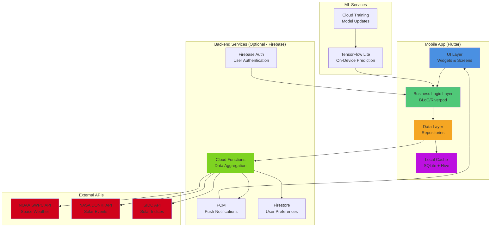
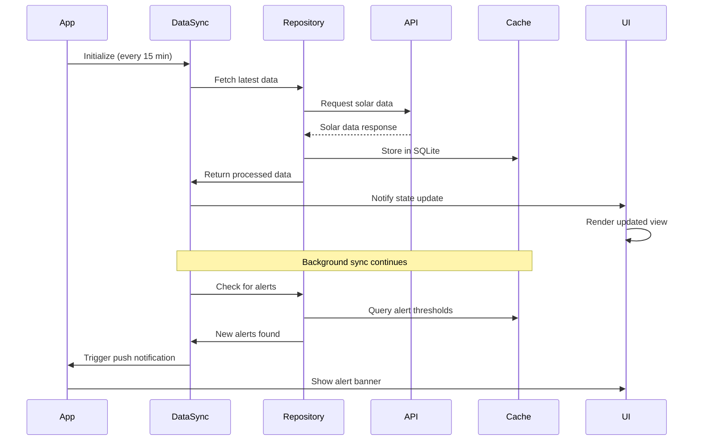
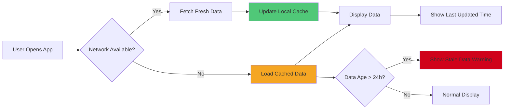
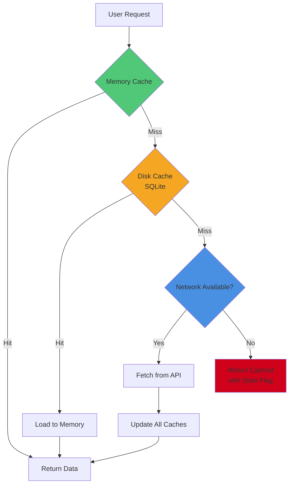
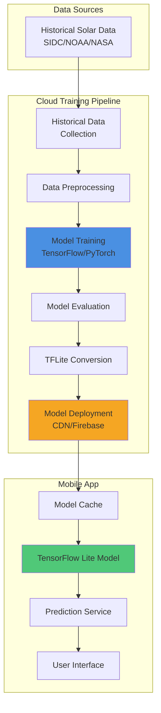

# Solar Cycle Mobile App - Technical Specification

**Version:** 1.0
**Date:** 2025-11-12
**Project:** Solar Cycle Mobile App MVP
**Timeline:** 12-16 weeks
**Target Platforms:** iOS 14+, Android 8+

---

## Table of Contents

1. [Executive Summary](#executive-summary)
2. [System Architecture](#system-architecture)
3. [Data Flow Architecture](#data-flow-architecture)
4. [Technology Stack](#technology-stack)
5. [Data Models & Schema](#data-models--schema)
6. [API Architecture](#api-architecture)
7. [External API Integrations](#external-api-integrations)
8. [Security & Privacy](#security--privacy)
9. [Performance & Scalability](#performance--scalability)
10. [Offline Mode Strategy](#offline-mode-strategy)
11. [AI/ML Prediction Engine](#aiml-prediction-engine)
12. [Development Phases](#development-phases)

---

## Executive Summary

The Solar Cycle Mobile App is a cross-platform mobile application built with Flutter that provides real-time solar activity data, forecasts, and educational content for space enthusiasts, educators, and amateur astronomers. The app integrates data from NOAA, NASA, and SIDC APIs, updates every 15 minutes, supports offline mode, and includes AI/ML-powered solar activity predictions.

### Key Features
- Real-time solar cycle data and visualization
- Solar flare, CME, and geomagnetic storm alerts
- AI-powered solar activity forecasting
- Educational content and resources
- Offline mode with local data caching
- Push notifications for significant solar events
- Interactive charts and historical data analysis

### Success Metrics
- < 3 second app launch time
- 95%+ uptime for data synchronization
- < 100KB per data update (bandwidth optimization)
- Support for devices with 2GB+ RAM
- < 50MB app size (excluding cached data)

---

## System Architecture

### High-Level Architecture



### Architecture Layers

#### 1. Presentation Layer (UI)
- **Framework:** Flutter with Material Design 3
- **State Management:** Riverpod 2.x for reactive state management
- **Navigation:** GoRouter for declarative routing
- **Components:**
  - Dashboard screen (home)
  - Solar cycle visualization charts
  - Alert/notification center
  - Educational content viewer
  - Settings and preferences
  - Historical data explorer

#### 2. Business Logic Layer
- **Pattern:** BLoC (Business Logic Component) architecture
- **State Management:** Riverpod providers
- **Components:**
  - Solar data processing
  - Alert filtering and prioritization
  - Prediction calculation
  - User preference management
  - Notification scheduling

#### 3. Data Layer
- **Pattern:** Repository pattern for data abstraction
- **Components:**
  - Remote data sources (API clients)
  - Local data sources (SQLite, Hive)
  - Data synchronization manager
  - Cache invalidation logic

#### 4. Storage Layer
- **SQLite:** Structured time-series solar data
- **Hive:** Key-value storage for preferences and cached objects
- **Secure Storage:** flutter_secure_storage for API keys and tokens

---

## Data Flow Architecture

### Real-Time Data Flow



### Offline Mode Data Flow



---

## Technology Stack

### Mobile Application

| Component | Technology | Justification |
|-----------|-----------|---------------|
| **Framework** | Flutter 3.24+ | Cross-platform development, single codebase, native performance, strong ecosystem |
| **Language** | Dart 3.5+ | Type-safe, null-safe, optimized for Flutter, excellent async support |
| **State Management** | Riverpod 2.x | Compile-time safety, better testability, less boilerplate than BLoC alone |
| **Local Database** | SQLite (sqflite) | Proven performance for time-series data, complex queries, ACID compliance |
| **Key-Value Store** | Hive | Fast, lightweight, no native dependencies, perfect for preferences |
| **HTTP Client** | Dio 5.x | Interceptors, retry logic, timeout handling, request cancellation |
| **Charts** | fl_chart | Native Flutter charts, customizable, good performance |
| **Notifications** | flutter_local_notifications | Local scheduling, customizable alerts |
| **Push Notifications** | Firebase Cloud Messaging | Reliable delivery, free tier, cross-platform |
| **Analytics** | Firebase Analytics (optional) | Privacy-focused, free tier, valuable insights |
| **Crash Reporting** | Firebase Crashlytics | Real-time crash detection, symbolication |
| **ML/AI** | TensorFlow Lite | On-device inference, low latency, privacy-preserving |
| **Background Tasks** | WorkManager (Android)<br/>Background Fetch (iOS) | Reliable background data sync |
| **Dependency Injection** | Riverpod providers | Built-in DI, testable, type-safe |

### Backend Services (Minimal/Serverless)

| Component | Technology | Justification |
|-----------|-----------|---------------|
| **Cloud Functions** | Firebase Cloud Functions (optional) | Serverless, pay-per-use, automatic scaling, direct API integration |
| **Authentication** | Firebase Auth (optional) | Free tier, social login support, secure token management |
| **Database** | Cloud Firestore (optional) | Real-time sync, offline support, NoSQL flexibility |
| **Storage** | Cloud Storage (optional) | Store ML models, educational content |
| **Hosting** | Firebase Hosting (optional) | CDN, SSL, version rollback |

### Development Tools

| Tool | Purpose |
|------|---------|
| **flutter_test** | Unit and widget testing |
| **integration_test** | E2E testing |
| **mockito** | Mocking dependencies |
| **flutter_lints** | Code quality enforcement |
| **build_runner** | Code generation (freezed, json_serializable) |
| **freezed** | Immutable data classes with union types |
| **json_serializable** | JSON serialization/deserialization |

### CI/CD

- **GitHub Actions:** Automated testing, building, deployment
- **Fastlane:** iOS/Android deployment automation
- **Codemagic:** Alternative CI/CD for Flutter (optional)

---

## Data Models & Schema

### Core Data Models

#### 1. Solar Cycle Data

```dart
@freezed
class SolarCycleData with _$SolarCycleData {
  const factory SolarCycleData({
    required String id,
    required DateTime timestamp,
    required double sunspotNumber,
    required double solarFluxF107,
    required double solarWindSpeed,
    required String geomagneticStormLevel, // G0-G5
    required double kpIndex,
    required double apIndex,
    required int cycleNumber,
    required String source, // NOAA, NASA, SIDC
    @Default([]) List<SolarEvent> activeEvents,
    SolarPrediction? prediction,
  }) = _SolarCycleData;

  factory SolarCycleData.fromJson(Map<String, dynamic> json) =>
      _$SolarCycleDataFromJson(json);
}
```

#### 2. Solar Event

```dart
@freezed
class SolarEvent with _$SolarEvent {
  const factory SolarEvent({
    required String id,
    required SolarEventType type,
    required DateTime startTime,
    DateTime? peakTime,
    DateTime? endTime,
    required String severity, // Minor, Moderate, Strong, Severe, Extreme
    required String description,
    required String source,
    double? latitude,
    double? longitude,
    Map<String, dynamic>? metadata,
  }) = _SolarEvent;

  factory SolarEvent.fromJson(Map<String, dynamic> json) =>
      _$SolarEventFromJson(json);
}

enum SolarEventType {
  solarFlare,      // X, M, C class flares
  cme,             // Coronal Mass Ejection
  geomagneticStorm,
  solarRadiationStorm,
  radioblackout,
  coronalHole,
}
```

#### 3. Solar Prediction

```dart
@freezed
class SolarPrediction with _$SolarPrediction {
  const factory SolarPrediction({
    required DateTime generatedAt,
    required DateTime validUntil,
    required List<PredictionDataPoint> predictions,
    required double confidenceScore,
    required String modelVersion,
    Map<String, dynamic>? metadata,
  }) = _SolarPrediction;

  factory SolarPrediction.fromJson(Map<String, dynamic> json) =>
      _$SolarPredictionFromJson(json);
}

@freezed
class PredictionDataPoint with _$PredictionDataPoint {
  const factory PredictionDataPoint({
    required DateTime timestamp,
    required double predictedSunspotNumber,
    required double predictedSolarFlux,
    required double confidenceInterval,
    String? alertLevel,
  }) = _PredictionDataPoint;

  factory PredictionDataPoint.fromJson(Map<String, dynamic> json) =>
      _$PredictionDataPointFromJson(json);
}
```

#### 4. User Preferences

```dart
@freezed
class UserPreferences with _$UserPreferences {
  const factory UserPreferences({
    @Default(true) bool notificationsEnabled,
    @Default([]) List<String> alertFilters, // Which event types to receive
    @Default('G3') String minimumAlertSeverity,
    @Default(15) int dataUpdateInterval, // minutes
    @Default(ThemeMode.system) ThemeMode themeMode,
    @Default('en') String language,
    @Default(TemperatureUnit.celsius) TemperatureUnit temperatureUnit,
    @Default(true) bool offlineModeEnabled,
    @Default(7) int dataCacheDays,
    DateTime? lastSyncTime,
  }) = _UserPreferences;

  factory UserPreferences.fromJson(Map<String, dynamic> json) =>
      _$UserPreferencesFromJson(json);
}
```

### SQLite Database Schema

```sql
-- Solar Cycle Data Table
CREATE TABLE solar_cycle_data (
    id TEXT PRIMARY KEY,
    timestamp INTEGER NOT NULL,
    sunspot_number REAL NOT NULL,
    solar_flux_f107 REAL NOT NULL,
    solar_wind_speed REAL NOT NULL,
    geomagnetic_storm_level TEXT NOT NULL,
    kp_index REAL NOT NULL,
    ap_index REAL NOT NULL,
    cycle_number INTEGER NOT NULL,
    source TEXT NOT NULL,
    prediction_json TEXT,
    created_at INTEGER DEFAULT (strftime('%s', 'now')),
    UNIQUE(timestamp, source)
);

CREATE INDEX idx_timestamp ON solar_cycle_data(timestamp DESC);
CREATE INDEX idx_cycle_number ON solar_cycle_data(cycle_number);
CREATE INDEX idx_source ON solar_cycle_data(source);

-- Solar Events Table
CREATE TABLE solar_events (
    id TEXT PRIMARY KEY,
    type TEXT NOT NULL,
    start_time INTEGER NOT NULL,
    peak_time INTEGER,
    end_time INTEGER,
    severity TEXT NOT NULL,
    description TEXT NOT NULL,
    source TEXT NOT NULL,
    latitude REAL,
    longitude REAL,
    metadata_json TEXT,
    created_at INTEGER DEFAULT (strftime('%s', 'now'))
);

CREATE INDEX idx_event_type ON solar_events(type);
CREATE INDEX idx_start_time ON solar_events(start_time DESC);
CREATE INDEX idx_severity ON solar_events(severity);

-- Predictions Table
CREATE TABLE predictions (
    id INTEGER PRIMARY KEY AUTOINCREMENT,
    generated_at INTEGER NOT NULL,
    valid_until INTEGER NOT NULL,
    confidence_score REAL NOT NULL,
    model_version TEXT NOT NULL,
    predictions_json TEXT NOT NULL,
    metadata_json TEXT,
    created_at INTEGER DEFAULT (strftime('%s', 'now'))
);

CREATE INDEX idx_valid_until ON predictions(valid_until DESC);

-- Cached API Responses (for offline mode)
CREATE TABLE api_cache (
    endpoint TEXT PRIMARY KEY,
    response_data TEXT NOT NULL,
    cached_at INTEGER NOT NULL,
    expires_at INTEGER NOT NULL
);

CREATE INDEX idx_expires_at ON api_cache(expires_at);

-- User Alerts/Notifications Log
CREATE TABLE alert_log (
    id INTEGER PRIMARY KEY AUTOINCREMENT,
    event_id TEXT NOT NULL,
    alert_type TEXT NOT NULL,
    severity TEXT NOT NULL,
    title TEXT NOT NULL,
    message TEXT NOT NULL,
    delivered_at INTEGER NOT NULL,
    read_at INTEGER,
    dismissed_at INTEGER,
    FOREIGN KEY (event_id) REFERENCES solar_events(id)
);

CREATE INDEX idx_delivered_at ON alert_log(delivered_at DESC);
```

### Hive Boxes (Key-Value Storage)

```dart
// Box Names
const String preferencesBox = 'user_preferences';
const String cacheBox = 'app_cache';
const String sessionBox = 'session_data';

// Stored Objects
// 1. preferencesBox: UserPreferences object
// 2. cacheBox: Map<String, dynamic> for various cached data
// 3. sessionBox: App state, last sync times, etc.
```

---

## API Architecture

### Internal API Layer (Repository Pattern)

```dart
// Abstract Repository Interface
abstract class SolarDataRepository {
  Future<Result<SolarCycleData>> getCurrentSolarData();
  Future<Result<List<SolarEvent>>> getActiveEvents();
  Future<Result<List<SolarCycleData>>> getHistoricalData({
    required DateTime startDate,
    required DateTime endDate,
  });
  Future<Result<SolarPrediction>> getPrediction({int daysAhead = 7});
  Stream<SolarCycleData> watchCurrentData();
}

// Implementation
class SolarDataRepositoryImpl implements SolarDataRepository {
  final NoaaApiClient _noaaClient;
  final NasaApiClient _nasaClient;
  final SidcApiClient _sidcClient;
  final LocalDatabase _localDb;
  final CacheManager _cacheManager;

  @override
  Future<Result<SolarCycleData>> getCurrentSolarData() async {
    try {
      // Check cache first
      final cached = await _cacheManager.get<SolarCycleData>('current_data');
      if (cached != null && !cached.isExpired) {
        return Result.success(cached.data);
      }

      // Fetch from multiple sources in parallel
      final results = await Future.wait([
        _noaaClient.getCurrentData(),
        _nasaClient.getCurrentData(),
        _sidcClient.getCurrentData(),
      ]);

      // Aggregate and reconcile data
      final aggregated = _aggregateData(results);

      // Save to cache and database
      await _localDb.saveSolarData(aggregated);
      await _cacheManager.set('current_data', aggregated, duration: Duration(minutes: 15));

      return Result.success(aggregated);
    } catch (e) {
      // Fall back to cached data if available
      final fallback = await _localDb.getLatestSolarData();
      if (fallback != null) {
        return Result.success(fallback, isStale: true);
      }
      return Result.failure(e);
    }
  }
}
```

### API Response Models

```dart
// Unified Result type for error handling
@freezed
class Result<T> with _$Result<T> {
  const factory Result.success(
    T data, {
    @Default(false) bool isStale,
    DateTime? lastUpdated,
  }) = Success<T>;

  const factory Result.failure(
    dynamic error, {
    String? message,
    StackTrace? stackTrace,
  }) = Failure<T>;
}
```

---

## External API Integrations

### 1. NOAA Space Weather Prediction Center (SWPC)

**Base URL:** `https://services.swpc.noaa.gov/`

**Key Endpoints:**

| Endpoint | Purpose | Update Frequency | Data Format |
|----------|---------|------------------|-------------|
| `/products/noaa-planetary-k-index.json` | Geomagnetic K-index | 3 hours | JSON |
| `/products/solar-wind/mag-1-day.json` | Solar wind magnetic field | 1 minute | JSON |
| `/products/solar-wind/plasma-1-day.json` | Solar wind plasma | 1 minute | JSON |
| `/json/f107_cm_flux.json` | F10.7 solar flux | Daily | JSON |
| `/text/3-day-forecast.txt` | 3-day forecast | 3x daily | Text |
| `/products/alerts.json` | Space weather alerts | Real-time | JSON |

**Example Implementation:**

```dart
class NoaaApiClient {
  final Dio _dio;
  static const String baseUrl = 'https://services.swpc.noaa.gov';

  Future<NoaaCurrentData> getCurrentData() async {
    try {
      final responses = await Future.wait([
        _dio.get('$baseUrl/products/noaa-planetary-k-index.json'),
        _dio.get('$baseUrl/products/solar-wind/plasma-1-day.json'),
        _dio.get('$baseUrl/json/f107_cm_flux.json'),
      ]);

      return NoaaCurrentData.fromMultipleResponses(responses);
    } on DioException catch (e) {
      throw ApiException.fromDioError(e);
    }
  }

  Future<List<SpaceWeatherAlert>> getAlerts() async {
    final response = await _dio.get('$baseUrl/products/alerts.json');
    return (response.data as List)
        .map((json) => SpaceWeatherAlert.fromJson(json))
        .toList();
  }
}
```

### 2. NASA DONKI (Database Of Notifications, Knowledge, Information)

**Base URL:** `https://api.nasa.gov/DONKI/`

**Key Endpoints:**

| Endpoint | Purpose | Parameters | Rate Limit |
|----------|---------|------------|------------|
| `/CME` | Coronal Mass Ejections | startDate, endDate | 1000/hour |
| `/FLR` | Solar Flares | startDate, endDate | 1000/hour |
| `/GST` | Geomagnetic Storms | startDate, endDate | 1000/hour |
| `/RBE` | Radiation Belt Enhancement | startDate, endDate | 1000/hour |
| `/notifications` | All notifications | startDate, endDate, type | 1000/hour |

**Authentication:** API key required (free tier available)

**Example Implementation:**

```dart
class NasaApiClient {
  final Dio _dio;
  static const String baseUrl = 'https://api.nasa.gov/DONKI';
  final String apiKey;

  NasaApiClient(this._dio, this.apiKey) {
    _dio.interceptors.add(
      InterceptorsWrapper(
        onRequest: (options, handler) {
          options.queryParameters['api_key'] = apiKey;
          return handler.next(options);
        },
      ),
    );
  }

  Future<List<SolarFlare>> getSolarFlares({
    required DateTime startDate,
    required DateTime endDate,
  }) async {
    final response = await _dio.get(
      '$baseUrl/FLR',
      queryParameters: {
        'startDate': _formatDate(startDate),
        'endDate': _formatDate(endDate),
      },
    );

    return (response.data as List)
        .map((json) => SolarFlare.fromJson(json))
        .toList();
  }

  String _formatDate(DateTime date) =>
      '${date.year}-${date.month.toString().padLeft(2, '0')}-${date.day.toString().padLeft(2, '0')}';
}
```

### 3. SIDC (Solar Influences Data Analysis Center)

**Base URL:** `https://www.sidc.be/SILSO/`

**Key Data:**

| Endpoint | Purpose | Format |
|----------|---------|--------|
| `/DATA/SN_d_tot_V2.0.csv` | Daily sunspot numbers | CSV |
| `/DATA/SN_m_tot_V2.0.csv` | Monthly sunspot numbers | CSV |
| `/DATA/SN_y_tot_V2.0.csv` | Yearly sunspot numbers | CSV |
| `/forecasts/` | Sunspot number predictions | Various |

**Example Implementation:**

```dart
class SidcApiClient {
  final Dio _dio;
  static const String baseUrl = 'https://www.sidc.be/SILSO';

  Future<List<SunspotData>> getDailySunspotNumbers({
    DateTime? since,
  }) async {
    final response = await _dio.get(
      '$baseUrl/DATA/SN_d_tot_V2.0.csv',
      options: Options(responseType: ResponseType.plain),
    );

    return _parseSunspotCsv(response.data, since: since);
  }

  List<SunspotData> _parseSunspotCsv(String csv, {DateTime? since}) {
    final lines = csv.split('\n');
    final data = <SunspotData>[];

    for (final line in lines) {
      if (line.trim().isEmpty || line.startsWith('#')) continue;

      final parts = line.split(';');
      if (parts.length < 4) continue;

      final year = int.parse(parts[0].trim());
      final month = int.parse(parts[1].trim());
      final day = int.parse(parts[2].trim());
      final sunspotNumber = double.parse(parts[3].trim());

      final date = DateTime(year, month, day);
      if (since != null && date.isBefore(since)) continue;

      data.add(SunspotData(
        date: date,
        sunspotNumber: sunspotNumber,
      ));
    }

    return data;
  }
}
```

### API Rate Limiting & Caching Strategy

```dart
class ApiRateLimiter {
  final Map<String, Queue<DateTime>> _requestLog = {};
  final Map<String, int> _limits = {
    'nasa': 1000, // per hour
    'noaa': 1000, // per hour (estimated)
    'sidc': 100,  // per hour (estimated)
  };

  Future<void> checkAndWait(String service) async {
    final now = DateTime.now();
    final queue = _requestLog.putIfAbsent(service, () => Queue<DateTime>());

    // Remove requests older than 1 hour
    while (queue.isNotEmpty &&
           now.difference(queue.first).inHours >= 1) {
      queue.removeFirst();
    }

    // Check if at limit
    if (queue.length >= (_limits[service] ?? 100)) {
      final oldestRequest = queue.first;
      final waitTime = Duration(hours: 1) - now.difference(oldestRequest);
      await Future.delayed(waitTime);
    }

    queue.add(now);
  }
}
```

---

## Security & Privacy

### 1. Data Security

**Encryption at Rest:**
- Sensitive user data encrypted using `flutter_secure_storage`
- SQLite database encryption using `sqlcipher` (optional for premium features)
- API keys stored in secure storage, never in SharedPreferences

**Encryption in Transit:**
- All API calls use HTTPS/TLS 1.3
- Certificate pinning for critical endpoints (optional)
- Request/response validation

**Implementation:**

```dart
class SecureStorageService {
  final FlutterSecureStorage _storage = const FlutterSecureStorage(
    aOptions: AndroidOptions(
      encryptedSharedPreferences: true,
    ),
    iOptions: IOSOptions(
      accessibility: KeychainAccessibility.first_unlock,
    ),
  );

  Future<void> saveApiKey(String provider, String key) async {
    await _storage.write(
      key: 'api_key_$provider',
      value: key,
    );
  }

  Future<String?> getApiKey(String provider) async {
    return await _storage.read(key: 'api_key_$provider');
  }
}
```

### 2. Privacy Considerations

**Data Collection:**
- Minimal personal data collection (only if user creates account)
- Anonymous usage analytics (opt-in)
- No location data unless explicitly permitted for aurora alerts

**GDPR Compliance:**
- Right to access: Export user data functionality
- Right to deletion: Complete account deletion
- Privacy policy clearly displayed
- Cookie/tracking consent

**Implementation:**

```dart
class PrivacyManager {
  Future<void> exportUserData() async {
    final preferences = await _getPreferences();
    final alertHistory = await _getAlertHistory();

    final export = {
      'preferences': preferences.toJson(),
      'alert_history': alertHistory.map((a) => a.toJson()).toList(),
      'exported_at': DateTime.now().toIso8601String(),
    };

    // Save to file or share
    await _saveToFile(jsonEncode(export));
  }

  Future<void> deleteAllUserData() async {
    await _database.delete();
    await _hive.deleteAllBoxes();
    await _secureStorage.deleteAll();
    // Reset to fresh install state
  }
}
```

### 3. Authentication (Optional for MVP)

For future user accounts feature:

```dart
class AuthService {
  final FirebaseAuth _auth = FirebaseAuth.instance;

  Future<Result<User>> signInAnonymously() async {
    try {
      final credential = await _auth.signInAnonymously();
      return Result.success(credential.user!);
    } catch (e) {
      return Result.failure(e);
    }
  }

  Future<Result<User>> signInWithEmail(String email, String password) async {
    try {
      final credential = await _auth.signInWithEmailAndPassword(
        email: email,
        password: password,
      );
      return Result.success(credential.user!);
    } catch (e) {
      return Result.failure(e);
    }
  }
}
```

### 4. API Key Management

**Best Practices:**
- API keys stored in environment variables for development
- Dart defines for build-time injection
- Never commit keys to version control

**build.gradle (Android):**
```gradle
android {
    defaultConfig {
        manifestPlaceholders = [
            nasaApiKey: System.getenv("NASA_API_KEY") ?: ""
        ]
    }
}
```

**Dart Configuration:**
```dart
class ApiConfig {
  static const String nasaApiKey = String.fromEnvironment(
    'NASA_API_KEY',
    defaultValue: '',
  );

  static void validate() {
    if (nasaApiKey.isEmpty) {
      throw Exception('NASA_API_KEY not configured');
    }
  }
}
```

---

## Performance & Scalability

### 1. Performance Targets

| Metric | Target | Measurement |
|--------|--------|-------------|
| Cold start time | < 3s | Time to interactive |
| Hot start time | < 1s | Resume from background |
| Data sync time | < 5s | Full data refresh |
| Chart render time | < 500ms | First paint |
| Database query time | < 100ms | 95th percentile |
| Memory footprint | < 150MB | Normal operation |
| Battery drain | < 2% per hour | Background sync active |

### 2. Optimization Strategies

**Image Optimization:**
```dart
// Use cached network images
CachedNetworkImage(
  imageUrl: imageUrl,
  memCacheWidth: 300,
  memCacheHeight: 300,
  maxWidthDiskCache: 600,
  maxHeightDiskCache: 600,
);
```

**List Virtualization:**
```dart
// Use ListView.builder for large lists
ListView.builder(
  itemCount: solarEvents.length,
  cacheExtent: 500,
  itemBuilder: (context, index) {
    return SolarEventCard(event: solarEvents[index]);
  },
);
```

**Data Pagination:**
```dart
class PaginatedDataLoader {
  static const int pageSize = 50;

  Future<List<SolarCycleData>> loadPage(int page) async {
    final offset = page * pageSize;
    return await _database.query(
      'solar_cycle_data',
      limit: pageSize,
      offset: offset,
      orderBy: 'timestamp DESC',
    );
  }
}
```

**Background Sync Optimization:**
```dart
// Use WorkManager for efficient background sync
class BackgroundSyncService {
  static Future<void> registerPeriodicSync() async {
    await Workmanager().registerPeriodicTask(
      'solar-data-sync',
      'syncSolarData',
      frequency: Duration(minutes: 15),
      constraints: Constraints(
        networkType: NetworkType.connected,
        requiresBatteryNotLow: true,
      ),
      backoffPolicy: BackoffPolicy.exponential,
    );
  }
}
```

### 3. Scalability Considerations

**Database Partitioning:**
- Automatic data cleanup for entries older than 90 days (configurable)
- Archive old data to compressed JSON files
- Index optimization for common queries

**API Request Batching:**
```dart
class BatchRequestManager {
  final _pending = <Future<dynamic>>[];
  Timer? _batchTimer;

  Future<T> addRequest<T>(Future<T> request) async {
    _pending.add(request);

    // Execute batch after 100ms or 10 requests
    if (_pending.length >= 10) {
      return await _executeBatch();
    }

    _batchTimer?.cancel();
    _batchTimer = Timer(Duration(milliseconds: 100), _executeBatch);

    return await request;
  }

  Future<void> _executeBatch() async {
    if (_pending.isEmpty) return;

    await Future.wait(_pending);
    _pending.clear();
  }
}
```

**Memory Management:**
```dart
class ImageMemoryCache {
  static final ImageMemoryCache _instance = ImageMemoryCache._internal();
  factory ImageMemoryCache() => _instance;
  ImageMemoryCache._internal();

  final LruMap<String, ui.Image> _cache = LruMap(maximumSize: 100);

  ui.Image? get(String key) => _cache[key];
  void put(String key, ui.Image image) => _cache[key] = image;
  void clear() => _cache.clear();
}
```

### 4. Monitoring & Observability

```dart
class PerformanceMonitor {
  static Future<T> measureAsync<T>(
    String operationName,
    Future<T> Function() operation,
  ) async {
    final stopwatch = Stopwatch()..start();
    try {
      final result = await operation();
      stopwatch.stop();
      _logMetric(operationName, stopwatch.elapsedMilliseconds);
      return result;
    } catch (e) {
      stopwatch.stop();
      _logError(operationName, stopwatch.elapsedMilliseconds, e);
      rethrow;
    }
  }

  static void _logMetric(String operation, int durationMs) {
    // Log to Firebase Performance or custom analytics
    FirebasePerformance.instance
        .newTrace(operation)
        .setMetric('duration_ms', durationMs)
        .stop();
  }
}
```

---

## Offline Mode Strategy

### 1. Data Caching Strategy

**Cache Hierarchy:**



**Implementation:**

```dart
class CacheManager {
  final MemoryCache _memoryCache;
  final LocalDatabase _diskCache;
  final ConnectivityService _connectivity;

  Future<CachedData<T>?> get<T>(String key) async {
    // Level 1: Memory cache
    final memCached = _memoryCache.get<T>(key);
    if (memCached != null) {
      return CachedData(
        data: memCached,
        source: CacheSource.memory,
        isStale: false,
      );
    }

    // Level 2: Disk cache
    final diskCached = await _diskCache.getCached<T>(key);
    if (diskCached != null) {
      // Promote to memory cache
      _memoryCache.set(key, diskCached.data);

      return CachedData(
        data: diskCached.data,
        source: CacheSource.disk,
        isStale: diskCached.isExpired,
        cachedAt: diskCached.cachedAt,
      );
    }

    return null;
  }

  Future<void> set<T>(
    String key,
    T data, {
    Duration? duration,
  }) async {
    final expiresAt = duration != null
        ? DateTime.now().add(duration)
        : DateTime.now().add(Duration(hours: 24));

    // Write to both caches
    _memoryCache.set(key, data);
    await _diskCache.cache(key, data, expiresAt: expiresAt);
  }
}

@freezed
class CachedData<T> with _$CachedData<T> {
  const factory CachedData({
    required T data,
    required CacheSource source,
    required bool isStale,
    DateTime? cachedAt,
  }) = _CachedData;
}

enum CacheSource { memory, disk, network }
```

### 2. Offline-First Architecture

```dart
class OfflineFirstRepository {
  final RemoteDataSource _remote;
  final LocalDataSource _local;
  final ConnectivityService _connectivity;

  Stream<Resource<T>> getData<T>() async* {
    // First, emit cached data immediately
    final cached = await _local.getData<T>();
    if (cached != null) {
      yield Resource.success(cached, source: DataSource.cache);
    }

    // Then, try to fetch fresh data if online
    if (await _connectivity.isConnected) {
      try {
        yield Resource.loading();

        final fresh = await _remote.getData<T>();
        await _local.saveData(fresh);

        yield Resource.success(fresh, source: DataSource.network);
      } catch (e) {
        // If network fails, keep showing cached data
        if (cached != null) {
          yield Resource.success(
            cached,
            source: DataSource.cache,
            error: e.toString(),
          );
        } else {
          yield Resource.error(e);
        }
      }
    }
  }
}

@freezed
class Resource<T> with _$Resource<T> {
  const factory Resource.loading() = Loading<T>;
  const factory Resource.success(
    T data, {
    required DataSource source,
    String? error,
  }) = Success<T>;
  const factory Resource.error(dynamic error) = Error<T>;
}
```

### 3. Data Synchronization

```dart
class SyncManager {
  final LocalDatabase _db;
  final List<RemoteDataSource> _dataSources;

  Future<SyncResult> synchronize() async {
    final result = SyncResult();

    try {
      // Get last sync time
      final lastSync = await _db.getLastSyncTime();

      // Sync each data source
      for (final source in _dataSources) {
        try {
          final newData = await source.fetchSince(lastSync);
          await _db.insertOrUpdate(newData);
          result.successCount++;
        } catch (e) {
          result.failures.add(SyncFailure(
            source: source.name,
            error: e.toString(),
          ));
        }
      }

      // Update last sync time
      await _db.setLastSyncTime(DateTime.now());

    } catch (e) {
      result.overallError = e.toString();
    }

    return result;
  }
}
```

### 4. Conflict Resolution

```dart
class ConflictResolver {
  /// Resolves conflicts when syncing data
  T resolve<T>(T local, T remote, DateTime lastSync) {
    // Strategy: Last-write-wins with timestamp comparison
    if (local is Timestamped && remote is Timestamped) {
      return (local as Timestamped).timestamp
              .isAfter((remote as Timestamped).timestamp)
          ? local
          : remote;
    }

    // Default: prefer remote data
    return remote;
  }
}
```

---

## AI/ML Prediction Engine

### 1. Prediction Architecture



### 2. Model Architecture

**Input Features:**
- Historical sunspot numbers (last 30 days)
- Solar flux F10.7 (last 30 days)
- Geomagnetic indices (Kp, Ap)
- Solar cycle phase
- Month/season (encoded)

**Model Type:** LSTM (Long Short-Term Memory) Neural Network

**Output:**
- Predicted sunspot number (7 days ahead)
- Confidence interval
- Predicted solar flux

**Model Architecture:**

```python
import tensorflow as tf

def create_solar_prediction_model(
    sequence_length=30,
    n_features=5,
    prediction_horizon=7
):
    model = tf.keras.Sequential([
        # Input layer
        tf.keras.layers.Input(shape=(sequence_length, n_features)),

        # LSTM layers
        tf.keras.layers.LSTM(128, return_sequences=True),
        tf.keras.layers.Dropout(0.2),
        tf.keras.layers.LSTM(64, return_sequences=True),
        tf.keras.layers.Dropout(0.2),
        tf.keras.layers.LSTM(32),
        tf.keras.layers.Dropout(0.2),

        # Dense layers
        tf.keras.layers.Dense(64, activation='relu'),
        tf.keras.layers.Dense(32, activation='relu'),

        # Output layer (prediction_horizon * 2 for mean and std)
        tf.keras.layers.Dense(prediction_horizon * 2),

        # Reshape to separate mean and uncertainty
        tf.keras.layers.Reshape((prediction_horizon, 2)),
    ])

    model.compile(
        optimizer='adam',
        loss='mse',
        metrics=['mae']
    )

    return model

# Convert to TensorFlow Lite
def convert_to_tflite(model, output_path):
    converter = tf.lite.TFLiteConverter.from_keras_model(model)
    converter.optimizations = [tf.lite.Optimize.DEFAULT]
    tflite_model = converter.convert()

    with open(output_path, 'wb') as f:
        f.write(tflite_model)
```

### 3. On-Device Inference

```dart
class PredictionService {
  late Interpreter _interpreter;
  bool _isInitialized = false;

  Future<void> initialize() async {
    if (_isInitialized) return;

    try {
      // Load model from assets
      _interpreter = await Interpreter.fromAsset('assets/models/solar_predictor.tflite');
      _isInitialized = true;
    } catch (e) {
      throw Exception('Failed to load ML model: $e');
    }
  }

  Future<SolarPrediction> predict(List<SolarCycleData> historicalData) async {
    if (!_isInitialized) await initialize();

    // Prepare input data
    final input = _prepareInput(historicalData);

    // Allocate output buffer
    final output = List.filled(7 * 2, 0.0).reshape([7, 2]);

    // Run inference
    _interpreter.run(input, output);

    // Parse output
    return _parseOutput(output);
  }

  List<List<List<double>>> _prepareInput(List<SolarCycleData> data) {
    // Ensure we have 30 days of data
    final last30Days = data.take(30).toList();

    // Normalize and extract features
    return [
      last30Days.map((d) => [
        _normalize(d.sunspotNumber, 0, 300),
        _normalize(d.solarFluxF107, 50, 300),
        _normalize(d.kpIndex, 0, 9),
        _normalize(d.apIndex, 0, 400),
        _encodeSeason(d.timestamp),
      ]).toList()
    ];
  }

  double _normalize(double value, double min, double max) {
    return (value - min) / (max - min);
  }

  double _encodeSeason(DateTime date) {
    // Encode as sine of day-of-year for cyclical nature
    final dayOfYear = date.difference(DateTime(date.year, 1, 1)).inDays;
    return sin(2 * pi * dayOfYear / 365);
  }

  SolarPrediction _parseOutput(List<List<double>> output) {
    final predictions = <PredictionDataPoint>[];
    final now = DateTime.now();

    for (int i = 0; i < 7; i++) {
      final mean = output[i][0];
      final std = output[i][1];

      predictions.add(PredictionDataPoint(
        timestamp: now.add(Duration(days: i + 1)),
        predictedSunspotNumber: mean * 300, // Denormalize
        predictedSolarFlux: 0.0, // Placeholder
        confidenceInterval: std * 300,
      ));
    }

    return SolarPrediction(
      generatedAt: now,
      validUntil: now.add(Duration(days: 7)),
      predictions: predictions,
      confidenceScore: _calculateConfidence(output),
      modelVersion: '1.0.0',
    );
  }

  double _calculateConfidence(List<List<double>> output) {
    // Calculate average confidence based on standard deviation
    final avgStd = output.map((o) => o[1]).reduce((a, b) => a + b) / output.length;
    return max(0.0, 1.0 - avgStd);
  }

  void dispose() {
    _interpreter.close();
  }
}
```

### 4. Model Updates

```dart
class ModelUpdateService {
  static const String modelUrl = 'https://storage.googleapis.com/solar-app/models/';

  Future<void> checkForUpdates() async {
    try {
      // Check remote version
      final remoteVersion = await _getRemoteModelVersion();
      final localVersion = await _getLocalModelVersion();

      if (remoteVersion > localVersion) {
        await _downloadAndInstallModel(remoteVersion);
      }
    } catch (e) {
      // Silent fail - continue using existing model
      print('Model update check failed: $e');
    }
  }

  Future<String> _getRemoteModelVersion() async {
    final response = await Dio().get('$modelUrl/version.json');
    return response.data['version'];
  }

  Future<void> _downloadAndInstallModel(String version) async {
    final tempPath = await getTemporaryDirectory();
    final modelPath = '${tempPath.path}/solar_predictor_$version.tflite';

    await Dio().download(
      '$modelUrl/solar_predictor_$version.tflite',
      modelPath,
    );

    // Verify model integrity
    if (await _verifyModel(modelPath)) {
      // Move to assets directory
      await _installModel(modelPath, version);
    }
  }
}
```

### 5. Training Pipeline (Cloud)

```python
# training_pipeline.py
import pandas as pd
import numpy as np
from datetime import datetime, timedelta

class SolarDataPipeline:
    def __init__(self):
        self.sequence_length = 30
        self.prediction_horizon = 7

    def fetch_training_data(self):
        """Fetch historical data from NOAA, NASA, SIDC"""
        # Implement data fetching
        pass

    def preprocess(self, df):
        """Preprocess and create sequences"""
        # Normalize features
        df['sunspot_norm'] = (df['sunspot_number'] - df['sunspot_number'].min()) / \
                             (df['sunspot_number'].max() - df['sunspot_number'].min())

        # Create sequences
        X, y = [], []
        for i in range(len(df) - self.sequence_length - self.prediction_horizon):
            X.append(df[i:i+self.sequence_length][['sunspot_norm', 'flux_norm', ...]].values)
            y.append(df[i+self.sequence_length:i+self.sequence_length+self.prediction_horizon]['sunspot_norm'].values)

        return np.array(X), np.array(y)

    def train_model(self, X_train, y_train):
        """Train the LSTM model"""
        model = create_solar_prediction_model()

        early_stopping = tf.keras.callbacks.EarlyStopping(
            monitor='val_loss',
            patience=10,
            restore_best_weights=True
        )

        model.fit(
            X_train, y_train,
            epochs=100,
            batch_size=32,
            validation_split=0.2,
            callbacks=[early_stopping]
        )

        return model

    def evaluate_model(self, model, X_test, y_test):
        """Evaluate model performance"""
        predictions = model.predict(X_test)
        mae = np.mean(np.abs(predictions - y_test))
        rmse = np.sqrt(np.mean((predictions - y_test) ** 2))

        return {
            'mae': mae,
            'rmse': rmse,
            'r2': r2_score(y_test.flatten(), predictions.flatten())
        }
```

---

## Development Phases

### Phase 1: Foundation (Weeks 1-3)

**Goals:**
- Set up project structure
- Implement core architecture
- Establish data models and database schema
- Set up CI/CD pipeline

**Deliverables:**
- Flutter project with proper folder structure
- Database schema implemented (SQLite + Hive)
- Repository pattern for data layer
- Unit test framework
- CI/CD with GitHub Actions

**Tasks:**
1. Initialize Flutter project with proper configuration
2. Set up state management (Riverpod)
3. Implement data models with Freezed
4. Create database schema and migrations
5. Implement repository interfaces
6. Set up dependency injection
7. Configure linting and formatting
8. Write initial unit tests

### Phase 2: API Integration (Weeks 4-6)

**Goals:**
- Integrate NOAA, NASA, and SIDC APIs
- Implement data aggregation logic
- Build caching system
- Implement error handling and retry logic

**Deliverables:**
- Working API clients for all three data sources
- Data aggregation service
- Multi-level caching system
- Background sync service
- Comprehensive error handling

**Tasks:**
1. Implement NOAA API client
2. Implement NASA DONKI API client
3. Implement SIDC API client
4. Build data aggregation service
5. Implement caching strategy
6. Add rate limiting
7. Create background sync service (WorkManager)
8. Write integration tests

### Phase 3: UI Development (Weeks 7-10)

**Goals:**
- Build all core screens
- Implement charts and visualizations
- Add animations and transitions
- Ensure responsive design

**Deliverables:**
- Dashboard with current solar data
- Historical data charts
- Alert/notification center
- Settings screen
- Educational content viewer
- Responsive UI for tablets

**Tasks:**
1. Create dashboard screen
2. Implement solar cycle charts (fl_chart)
3. Build alert list and detail screens
4. Create settings screen
5. Implement educational content viewer
6. Add animations and transitions
7. Responsive layout for tablets
8. Widget tests for all screens

### Phase 4: Offline Mode & Predictions (Weeks 11-13)

**Goals:**
- Implement offline-first architecture
- Integrate TensorFlow Lite model
- Build prediction UI
- Add local notifications

**Deliverables:**
- Fully functional offline mode
- AI predictions integrated
- Push and local notifications
- Data sync indicator

**Tasks:**
1. Implement offline-first repository
2. Add connectivity monitoring
3. Integrate TensorFlow Lite model
4. Build prediction service
5. Create prediction UI
6. Implement local notifications
7. Add push notifications (FCM)
8. Test offline scenarios

### Phase 5: Testing & Polish (Weeks 14-15)

**Goals:**
- Comprehensive testing
- Performance optimization
- Bug fixes
- Accessibility improvements

**Deliverables:**
- > 80% code coverage
- Performance benchmarks met
- Zero critical bugs
- Accessibility compliance

**Tasks:**
1. Write remaining unit tests
2. Integration testing
3. E2E testing
4. Performance profiling
5. Memory leak detection
6. Accessibility audit
7. Bug fixes
8. Documentation

### Phase 6: Release Preparation (Week 16)

**Goals:**
- App store preparation
- Beta testing
- Final QA
- Release

**Deliverables:**
- iOS and Android builds
- App store listings
- Privacy policy
- User documentation
- Public release

**Tasks:**
1. Generate release builds
2. Create app store screenshots
3. Write app descriptions
4. Submit to App Store / Play Store
5. Beta testing with TestFlight / Internal Testing
6. Address feedback
7. Final QA pass
8. Public release

---

## Success Criteria

### MVP Success Metrics

1. **Functionality:**
   - ✅ Display current solar cycle data
   - ✅ Show solar events (flares, CMEs, geomagnetic storms)
   - ✅ 7-day predictions with confidence scores
   - ✅ Push notifications for major events
   - ✅ Offline mode functional
   - ✅ Data updates every 15 minutes

2. **Performance:**
   - ✅ App launch < 3 seconds
   - ✅ Data refresh < 5 seconds
   - ✅ UI smooth (60 FPS)
   - ✅ Memory usage < 150MB

3. **Quality:**
   - ✅ Zero critical bugs
   - ✅ > 80% code coverage
   - ✅ 4+ star rating target
   - ✅ < 1% crash rate

4. **User Adoption:**
   - 🎯 1,000 downloads in first month
   - 🎯 30% DAU/MAU ratio
   - 🎯 Average session length > 3 minutes

---

## Appendix

### A. Glossary

- **CME:** Coronal Mass Ejection - Large expulsion of plasma from the Sun
- **F10.7:** Solar radio flux at 10.7 cm wavelength
- **Kp Index:** Geomagnetic activity index (0-9 scale)
- **Ap Index:** Daily average geomagnetic activity
- **Sunspot Number:** Count of sunspots, indicator of solar activity
- **Solar Cycle:** ~11-year cycle of solar activity

### B. References

- NOAA Space Weather Prediction Center: https://www.swpc.noaa.gov/
- NASA DONKI: https://ccmc.gsfc.nasa.gov/tools/DONKI/
- SIDC: https://www.sidc.be/
- Flutter Documentation: https://flutter.dev/docs
- TensorFlow Lite: https://www.tensorflow.org/lite

### C. Contact & Support

- **Project Repository:** https://github.com/bison808/Sun
- **Issue Tracker:** GitHub Issues
- **Documentation:** /docs folder

---

**Document End**

*This technical specification is a living document and will be updated as the project evolves.*
